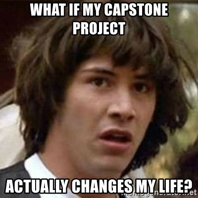
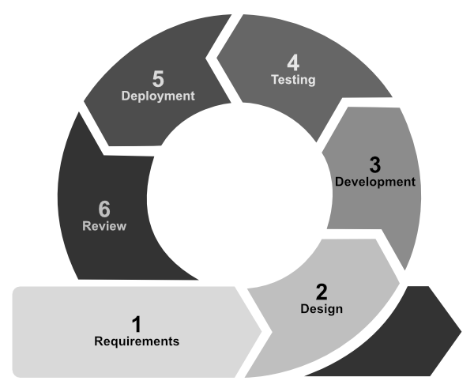
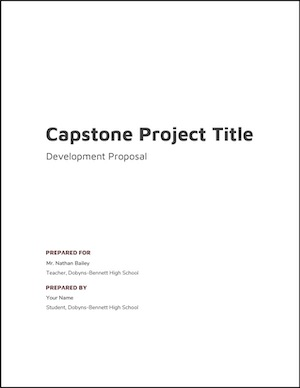
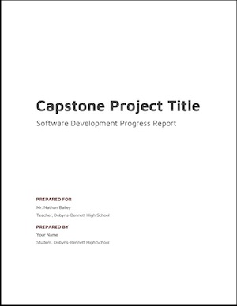

---
# Page settings
layout: default
head_title: Capstone
keywords:
comments: false

# Hero section
title: Capstone Project
description: > 
    A culminating project, that encompasses all the skills and concepts learned during the course. The project will occur over the entire semester, and has several deadlines spread throughout.

author:
    title: ""
    title_url: "#"
    external_link: false
    description: 

# Micro navigation
micro_nav: true
---

# Overview

A capstone project is a culminating project, that encompasses all the skills and concepts learned during the course. It requires independent application of the courses content to develop a software project following the Software Development Life Cycle. You will document your progress for a final presentation at the end of the semester.

Capstone projects are an opportunity to create a showcase software artifact for your portfolio that can open doors for you next step towards a career in software development. Not only do you get to work on something you are personally interested in, but you also get to hone skills that are unique to your career interests. Consider this project an opportunity to learn deeply about a topic you care about and to prepare yourself for the next level.

## Objectives

- Create a semester-long independent software project.
- Select and utilize an appropriate development environment.
- Demonstrate independent application of the software development life cycle.
- Document and report on project progress.
- Present project emphasizing the SDLC.

## TN Standards

- Design, manage, and develop a course-long programming project pre-approved by the instructor. The project will embody a variety of strategies and resources taught in this course, and require periodic reviews, status reports, and final project presentation. Use a software development environment to manage, document, test, deploy, and maintain the resources and assets of the finished project. *[Standard 20]*

## Requirements

- Must utilize JavaScript.
- Code must be stored on GitHub in a public repository.
- Project large enough in scope to require work over an entire semester.
- Project must involve a substantial design and development effort.
- Efforts must culminate in an intriguing, functioning software artifact.
- Project must be presented using formal oral presentations and written reports.

# Milestones

The capstone project will follow an agile software development life cycle. 

**Figure 1** - *Agile Software Development Life Cycle*

## Requirements

### Project Proposal

To begin the capstone project, you will submit a project proposal that details your plans for the project. In the proposal you will define the requirements for the project, which will begin the software development life cycle (see Figure 1).

  
<strong><b>Deliverable</b> - Project Proposal</strong>

  
Open the link below to create a copy of the Proposal Template. Send an email to <a href="mailto:dbailey@k12k.com?subject=Capstone%20Project%20Proposal">dbailey@k12k.com</a> with the subject "Capstone Project Proposal" and attach the Google Doc in the body of the email.

   
  

    

     
    <a href="https://docs.google.com/document/d/16D3h80V5AoWOj6hw0gu3_fPd4YBigFrSgpnU8pUuuMs/copy" class="btn btn--dark btn--rounded btn--w-icon">Make a Copy of the Proposal Template</a>
  

## Design

Choose appropriate tools to design the UI, model the software's data, and create flowcharts of any important logic.

  
<strong><b>Deliverable</b> - Project Design</strong>

  
Send an email to <a href="mailto:dbailey@k12k.com?subject=Capstone%20Project%20Design">dbailey@k12k.com</a> with the subject "Capstone Project Design" and attach links to all documents included in your design in the body of the email.

## Develop

### GitHub Repository

GitHub will be used to host your code. As the software is developed, changes should be pushed to GitHub, so I can track your progress, submit reviews, and suggest improvements. **If it is not on the repo, it does not exist.**

  
<strong><b>Deliverable</b> - GitHub Repository</strong>

  <ol>
    <li>Open the link below.</li>
    <li>Create a new repository.</li>
  
   
    <a href="https://github.com/new" class="btn btn--dark btn--rounded btn--w-icon"><i class="icon icon--github"></i>Start a New Repository</a>
  <li>Use the form below to submit a link to your repository.</li>
</ol>
<iframe src="https://docs.google.com/forms/d/e/1FAIpQLSfbXiOT6paIvlhZpjRs3GPLUap124njWmThkUJl03kR3WQa8g/viewform?embedded=true"  style="max-width: 640px;" width="100%" height="707" frameborder="0" marginheight="0" marginwidth="0">Loading…</iframe>

### Reports

Throughout the semester you will submit reports on the progress of your project.  The report should make reference to the software development life cycle (see Figure 1).

  
<strong><b>Deliverable</b> - Project Progress Report</strong>

  
Open the link below and make a copy of the Report Template. Send an email to <a href="mailto:dbailey@k12k.com?subject=Caspstone%20Project%20Proposal">dbailey@k12k.com</a> with "Capstone Project Proposal" in the subject line and attach the Google Doc in the body of the email.

   
  

    

     
    <a href="https://docs.google.com/document/d/16D3h80V5AoWOj6hw0gu3_fPd4YBigFrSgpnU8pUuuMs/copy" class="btn btn--dark btn--rounded">Make a Copy of the Report Template</a>
  

## Testing

Your project should include testing and code reviews. 

### Tests

<strong><b>Deliverable</b> - Tests</strong>

Your project should include at least one <b>Unit Test</b> and one <b>Integration Test</b>. You may choose a testing framework and any tools necessary to implement those tests. Test should be executable as an npm script and use the command <code>npm run test</code>.

### Code Reviews

<strong><b>Deliverable</b> - Code Review</strong>

At some point during the development of your project, you will need a classmate to complete a code review of your project. Start a pull request and request a review by a person in the class. Communicate back and forth through the pull request, and utilize feedback to modify your code. Submit a link to the pull request below.

<iframe src="https://docs.google.com/forms/d/e/1FAIpQLSdkGKE9-VM8muEOYAKPq6JwISRmKqQOmi0bJh5dVRIhuVvRvw/viewform?embedded=true"  style="max-width: 640px;" width="100%" height="800" frameborder="0" marginheight="0" marginwidth="0">Loading…</iframe>

## Deployment

### Software Artifact

Your software artifact must be published in a way that is accessible to the public via the internet. It is okay if it must be downloaded, but it must be available to the public.

<strong><b>Deliverable</b> - Software Artifact</strong>

Make your software public. Submit a link to the project below. <b>Be sure it's public by opening an Incognito tab and checking that it is still accessible.</b>

<iframe src="https://docs.google.com/forms/d/e/1FAIpQLSf4Beh-fxO_B22SiL0YekAtyDHc9FNl0FpX93SW6f1mF-F0rQ/viewform?embedded=true"  style="max-width: 640px;" width="100%" height="724" frameborder="0" marginheight="0" marginwidth="0">Loading…</iframe>

## Review

### Presentation

For your final, you will present your Capstone Project to your classmates and a group of professionals. The presentation should demonstrate your final software artifact and explain your journey through the Software Development Life Cycle.

  
<strong><b>Deliverable</b> - Final Presentation</strong>

  
You can use an template for your presentation, but Slide Carnival offers some good ones for technology presentations. Consider using a template to make you presentation more professional.

   
  
<a href="https://www.slidescarnival.com/tag/tech" class="btn btn--dark btn--rounded btn--w-icon">Slide Carnival Templates</a>

  

    <b>Send an email to dbailey@k12k.com with "Capstone Project Presentation" in the subject line and attach a link to your presentation in the body of the email.</b>
  

    
<strong>Document Your Work Early and Often</strong>

    
Your presentation should include video, screenshots, code snippets that help visualize your development process. <b>Be sure to collect evidence throughout the project in a Google Drive folder for use in the presentation</b>

# Deliverables and Due Dates

| Deliverable                             | Due Date          |
| --------------------------------------- | ----------------- |
| [Project Proposal](#project-proposal)   | January 31, 2020  |
| [UI/UX Design](#design)                 | February 14, 2020 |
| [Project Report #1](#reports)           | February 28, 2020 |
| [Project Report #2](#reports)           | March 20, 2020    |
| [Project Report #3](#reports)           | April 17, 2020    |
| [Code Review](#code-reviews)            | May 1, 2020       |
| [Software Artifact](#software-artifact) | May 15, 2020      |
| [Project Presentation](#presentation)   | May 18, 2020      |
