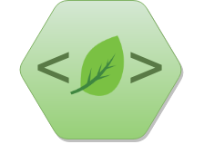

# Tutorials

## Tutorials

  - [Presentations](https://bookdown.org/yihui/rmarkdown/presentations.html)
  - [reveal.js](https://bookdown.org/yihui/rmarkdown/revealjs.html)

# Outline

## Outline
- Introduction
  - Motivation
- Methods
  - Analysis
- Results and Discussion
- Conclusions
- References

# Introduction

## Motivation

- First
- Second

# Methods

## Experimental Methods

Describe all the Methods

## Analysis

Describe the packages and analysis

# Results and Discussion

## Results

Plot the results

```{r}
boxplot(iris[,1:4])
```

## Images

Insert images

<br><center><center>

## New image

<br><left><left>

## Images option

Insert images


# Conclusions


# References 
