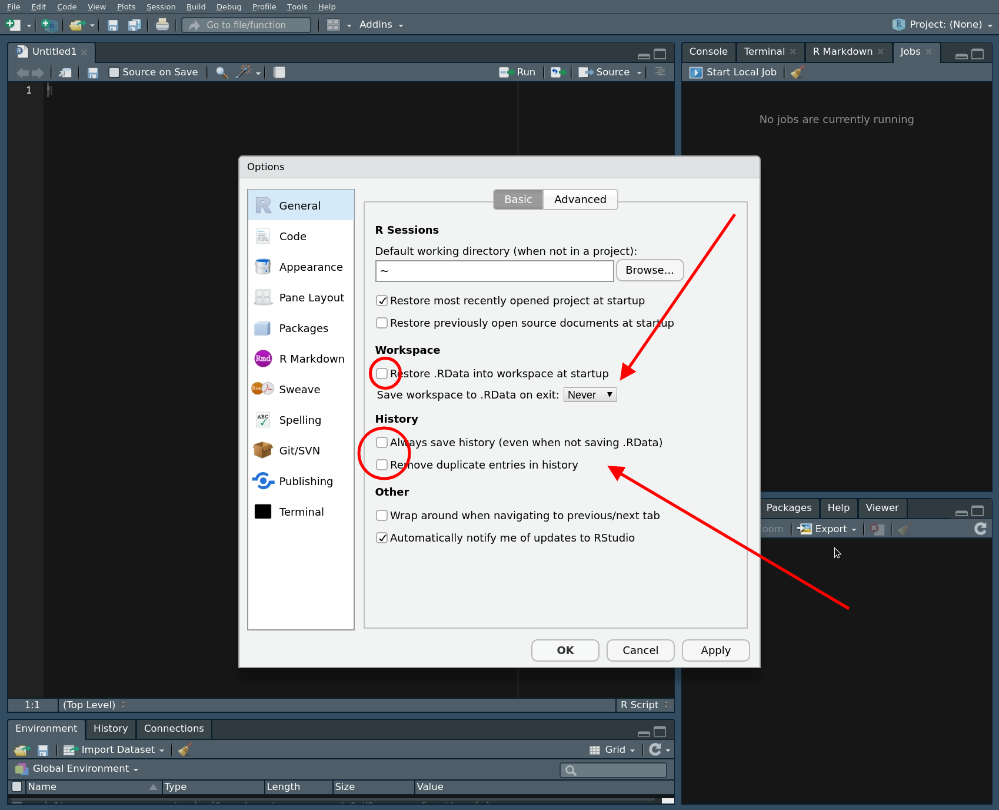

---
# Page settings
layout: default
head_title: R and RStudio 
keywords:
comments: false

# Hero section
title: R and RStudio<br>Getting started
description: >

# Micro navigation
micro_nav: false

# Page navigation
page_nav:
    prev:
        content: Course Introduction
        url: '/RPP/u1/'
    next:
        content: Project Management - Git
        url: '/RPP/u3/'
---

# What is R?

R is a statistical programming language that has rapidly gained popularity in many scientific fields. It was developed by Ross Ihaka and Robert Gentleman as an open source implementation of the "S" programming language. (Next time you need a fun fact, you can say "Did you know that S came before R?") R is also the name of the software that uses this language for statistical computing. With a huge online support community and dedicated packages that provide extra functionality for virtually any application and field of study, there's hardly anything you _can't_ do in R. 

If you already know your way around statistical softwares like `Minitab` or `SPSS`, the main difference is that `R` has no __graphical user interface__, which means there are no buttons to click and no dropdown menus. `R` can be run entirely by typing commands into a text interface (welcome to the Matrix!). This may seem a little daunting, but it also means a whole lot more flexibility, as you are not relying on a pre-determined toolkit for your analyses.

Thanks for joining us on your learning journey. Like with any language, there is a learning curve, but we will take it step by step, and in no time you will be coding your own analyses and graphs! 


 
If you need any more convincing, why are we using R and not one of the many other statistical packages like MATLAB, Minitab, or even Microsoft Excel? Well, R is great because:

- R is free and open source, and always will be! Anybody can use the code and see exactly how it works.
- Because R is a programming language rather than a graphical interface, the user can easily save scripts as small text files for use in the future, or share them with collaborators.
- R has a very active and helpful online community - normally a quick search is all it takes to find that somebody has already solved the problem you're having. You can start with our [page with useful links](https://ourcodingclub.github.io/links.html)!

# Download R and RStudio

As we said before, R itself does not have a graphical interface, but most people interact with R through graphical platforms that provide extra functionality. We will be using a program called __RStudio__ as a graphical front-end to R, so that we can access our scripts and data, find help, and preview plots and outputs all in one place.


You can download R from [CRAN (The Comprehensive R Archive Network)](https://cran.r-project.org/). Select the link appropriate for your operating system. 

Then, download RStudio from [the RStudio website](https://www.rstudio.com/products/RStudio/) (select the free open source desktop version).

If you are using a Mac, in addition to R and RStudio, you need to download XQuartz ([available here](https://www.xquartz.org/)).

__Open RStudio. Click on _"File/New File/R script"_.__

OR

__Open RStudio. Click on _"File/New File/R Markdown"_.__


You will now see a window like the one above. You _can_ type code directly into the __console__ on the up right (doesn't mean that you _should_\*!). Pressing enter at the end of the line runs the code (try typing `2 + 2` and running it now). You can (should!) also write your code in the __script__ file in the top left window. To run a line of code from your script, press `Ctrl+R` on Windows or `Cmd+Enter` on a Linux/Mac. On newer Windows computers, the default shortcut is `Ctrl+Enter`. The __environment window__ gives you an overview of your current __workspace\*\*__. You will see the data you have imported, objects you have created, functions you have defined, etc. Finally, the last panel has multiple tabs and will preview your plot and allow you to navigate around folders and look at the packages you currently have installed and loaded. 

> __\*A note about scripts (We love scripts!)__: Remember that if you enter code directly into the console, it will __not__ be saved by R: it runs and disappears (although you can access your last few operations by hitting the 'up' key on your keyboard). Instead, by typing your code into a script file, you are creating a reproducible record of your analysis. Writing your code in a script is similar to writing an essay in Word: it saves your progress and you can always pick up where you left off, or make some changes to it. (Remember to click _Save_ (`Ctrl+S`) often, so that you actually save your script!) 
When writing a script, it's useful to add comments to describe what you are doing by inserting a hasthag `#` in front of a line of text. R will see anything that begins with `#`as text instead of code, so it will not try to run it, but the text will provide valuable information about the code for whoever is reading your script (including future you!). Like with any piece of writing, scripts benefit from structure and clarity: you can find more details [here](http://adv-r.had.co.nz/Style.html).

> __\*\*A quicker note about the workspace__: The workspace will have everything you have used in a session floating around your computer memory. When you exit, R will ask you if you want to save the current workspace. You almost [never need to](https://www.r-bloggers.com/using-r-dont-save-your-workspace/), and it's best to click no and start with a clear slate every time. (DO make sure you save your script though!!)



# Begin a section

__Open RStudio. Click on _"File/New File/R Markdown"_.__

For now, start by recording who is writing, the date, and the main goal. Here's an example, which you can copy, paste and edit into your new script:


The next few lines of code usually load the packages you will be needing for your analysis. A __package__ is a bundle of commands that can be loaded into R to provide extra functionality. For example, you might load a package for formatting data, or for making maps. (Or for making graphs with [cats on them](https://github.com/Gibbsdavidl/CatterPlots), or whatever floats your boat... As we said before, there's virtually nothing you cannot do!) 

To install a package, type `install.packages("package-name")`. You only need to install packages once, so in this case you can type directly in the console box, rather than saving the line in your script and re-installing the package every time. 

Once installed, you just need to load the packages using `library(package-name)`. Today we will be using the [`ggplot2` package](https://cran.r-project.org/web/packages/ggplot2/index.html) to provide amazing plots. (You will learn more about the powerful features of `ggplot2` in a later calss.

The next lines of code should define your __working directory__. This is a folder on your computer where R will look for data, save your plots, etc. To make your workflow easier, it is good practice to save everything related to one project in the same place, as it will save you a lot of time typing up computer paths or hunting for files that got saved R-knows-where. For instance, you could save your script and all the data for this class in a folder called "RPP2020". (It is good practice to avoid spaces in file names as it can sometimes confuse R.) For bigger projects, consider having a root folder with the name of the project (e.g. "My_PhD") as your working directory, and other folders nested within to separate data, scripts, images, results, etc. (e.g. My_PhD/Chapter_1/data, My_PhD/Chapter_1/plots, My_PhD/Chapter_2/data, etc.)

To find out where your working directory is now, run the code `getwd()`. If you want to change it, you can use `setwd()`. Set your working directory to the folder you just downloaded from GitHub:

```r
install.packages("ggplot2")
library(ggplot2)
# Note that there are quotation marks when installing a package, but not when loading it
# and remember that hashtags let you add useful notes to your code! 

setwd("RPP2020")
# This is an example filepath, alter to your own filepath
```

__Watch out!__ Note that on a Windows computer, a copied-and-pasted file path will have backslashes separating the folders (`"C:\folder\data"`), but the filepath you enter into R should use __forward slashes__ (`"C:/folder/data"`). 

# Glossary:

To recap, here are a few important terms:

- __argument__: an element of a function, either essential or optional, that informs or alters how the function works. For instance, it can be a file path where the function should import from or save to: `file = \"file-path\"`. It can modify the colours in a plot: `col = \"blue\"`. You can always find which arguments are taken by a function by typing `?function-name`into the command line.
- __class__: the type of data contained in a variable: usually character (text/words), numeric (numbers), integer (whole numbers), or factor (grouping values, useful when you have multiple observations for sites or treatments in your data).
- __command__: a chunk of code that performs an action, typically contains one or more functions. You run a command by pressing \"Run\" or using a keyboard shortcut like `Cmd+Enter`, `Ctrl+Enter` or `Ctrl+R`
- __comment__: a bit of text in a script that starts with a hashtag `#` and isn't read as a command. Comments make your code readable to other people: use them to create sections in your script and to annotate each step of your analysis
- __console__: the window where you can type code directly in the command line (`2+2` followed by `Enter` will return `4`), and where the outputs of commands you run will show.
- __data frame__: a type of R object which consists of many rows and columns; think Excel spreadsheet. Usually the columns are different variables (e.g. age, colour, weight, wingspan), and rows are observations of these variables (e.g. for bird1, bird2, bird3) . 
- __csv file__: a type of file commonly used to import data in R, where the values of different variables are compressed together (a string, or line of values per row) and separated only by commas (indicating columns). R can also accept Excel (.xlsx) files, but we do not recommend it as formatting errors are harder to avoid.
- __function__: code that performs an action, and really how you do anything in R. Usually takes an input, does something to it, and returns an output (an object, a test result, a file, a plot). There are functions for importing, converting, and manipulating data, for performing specific calculations (can you guess what `min(10,15,5)` and `max(10,15,5)` would return?), making graphs, and more. 
- __object__: the building blocks of R. If R was a spoken language, functions would be verbs (actions) and objects would be nouns (the subjects or, well, objects of these actions!). Objects are called by typing their name _without_ quotation marks. Objects store data, and can take different forms. The most common objects are data frames and vectors, but there are many more, such as lists and matrices. 
- __package__: a bundle of functions that provide functionality to R. Many packages come automatically with R, others you can download for specific needs.
- __script__: Similar to a text editor, this is where you write and save your code for future reference. It contains a mix of code and comments and is saved as a simple text file that you can easily share so that anyone can reproduce your work.
- __vector__: a type of R object with one dimension: it stores a line of values which can be character, numeric, etc. 
- __working directory__: the folder on your computer linked to your current R session, where you import data from and save files to. You set it at the beginning of your session with the `setwd()` function.
- __workspace__: this is your virtual working environment, which contains all the functions of the packages you have loaded, the data you have imported, the objects you have created, and so on. It's usually best to start a work session with a clear workspace.
