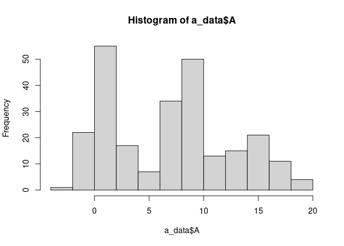
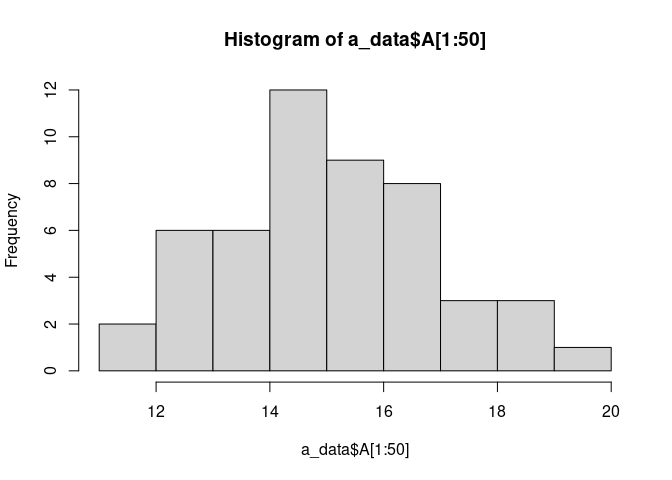
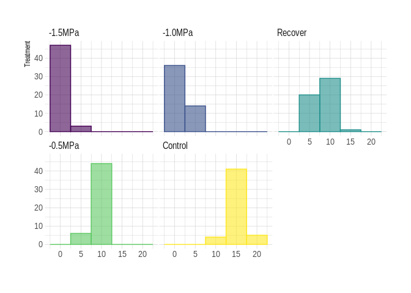
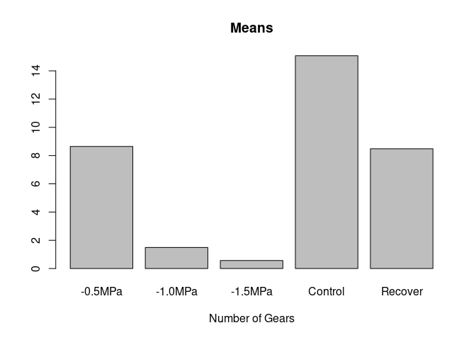
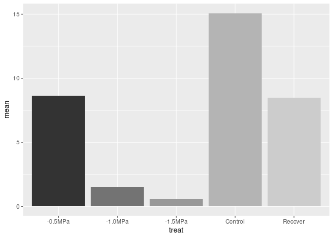
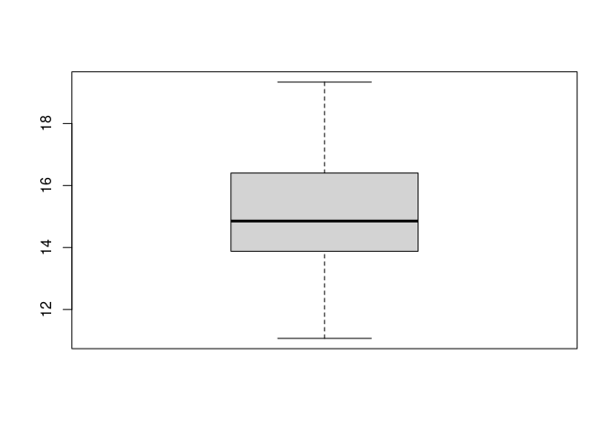
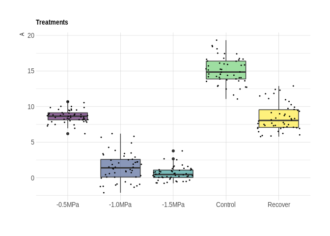
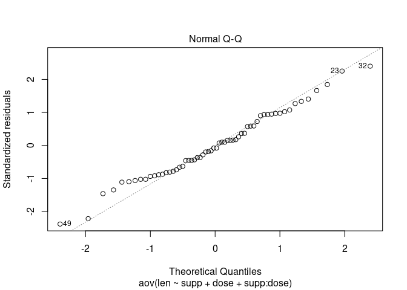
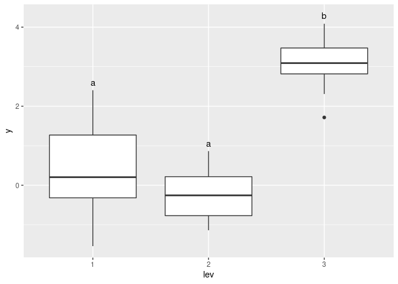

<!-- render("anova.Rmd", md_document()) -->

Find [here](https://teachresources.github.io/RPP/u7/anova.Rmd) the
correspondent `*Rmd`.

Data Analysis
=============

Descriptive Statistics and Graphics
===================================

Descritive Analysis
-------------------

Descriptive statistics give you a meaningful, quantitative overview over
your sample and helps you summarizing an overwhelming amount of data
into something somehow more comprehensible. It is generally a first step
into statistical analysis, even though it only reflects what your data
are made of.

Import the data into R
----------------------

Prepare your data and import it into R with one of the following
examples or others functions as you desire.

    read.table(file, header = FALSE, sep = "", dec = ".")
    read.csv(file, header = TRUE, sep = ",", dec = ".", ...)
    read.delim(file, header = TRUE, sep = "\t", dec = ".", ...)

For this tutorial, we are generating a fake data set from 5 treatment
groups.

    set.seed(123)
    # create five treatments with different means 
    treatA <- rnorm(50, mean=15, sd=2)
    treatB <- rnorm(50, mean=8.5, sd=1)
    treatC <- rnorm(50, mean=2, sd=2)
    treatD <- rnorm(50, mean=0.53, sd=1)
    treatE <- rnorm(50, mean=8.5, sd=2)

    # make a blank data frame 
    a_data <- data.frame(treat=character(250), A=numeric(250)) 

    # populate the data frame
    a_data$treat <- c(rep("Control",50), rep("-0.5MPa",50), rep("-1.0MPa",50), rep("-1.5MPa",50), rep("Recover",50))
    a_data$A <- c(treatA, treatB, treatC, treatD, treatE)
    tibble::tibble(a_data)

    ## # A tibble: 250 x 2
    ##    treat       A
    ##    <chr>   <dbl>
    ##  1 Control  13.9
    ##  2 Control  14.5
    ##  3 Control  18.1
    ##  4 Control  15.1
    ##  5 Control  15.3
    ##  6 Control  18.4
    ##  7 Control  15.9
    ##  8 Control  12.5
    ##  9 Control  13.6
    ## 10 Control  14.1
    ## # … with 240 more rows

Check your data
---------------

    tibble::tibble(a_data)

    ## # A tibble: 250 x 2
    ##    treat       A
    ##    <chr>   <dbl>
    ##  1 Control  13.9
    ##  2 Control  14.5
    ##  3 Control  18.1
    ##  4 Control  15.1
    ##  5 Control  15.3
    ##  6 Control  18.4
    ##  7 Control  15.9
    ##  8 Control  12.5
    ##  9 Control  13.6
    ## 10 Control  14.1
    ## # … with 240 more rows

    head(a_data)

    ##     treat  A
    ## 1 Control 14
    ## 2 Control 15
    ## 3 Control 18
    ## 4 Control 15
    ## 5 Control 15
    ## 6 Control 18

Load libraries
--------------

    library(viridis)
    library(tidyverse)
    library(hrbrthemes)
    library(ggsn)
    library(extrafont)
    library(agricolae)

Functions in R
--------------

Some R functions for computing descriptive statistics:

<table>
<thead>
<tr class="header">
<th>Description</th>
<th>R function</th>
</tr>
</thead>
<tbody>
<tr class="odd">
<td>Mean</td>
<td>mean()</td>
</tr>
<tr class="even">
<td>Standard deviation</td>
<td>sd()</td>
</tr>
<tr class="odd">
<td>Variance</td>
<td>var()</td>
</tr>
<tr class="even">
<td>Minimum</td>
<td>min()</td>
</tr>
<tr class="odd">
<td>Maximum</td>
<td>max()</td>
</tr>
<tr class="even">
<td>Median</td>
<td>median()</td>
</tr>
<tr class="odd">
<td>Sample quantiles</td>
<td>quantile()</td>
</tr>
<tr class="even">
<td>Generic function</td>
<td>summary()</td>
</tr>
</tbody>
</table>

    stats <- a_data %>%
      group_by(treat) %>%
      summarise(
        n = n(), ## check missing values
        mean = mean(A),
        sd = sd(A), ## Standard deviation
        se = sd/sqrt(n), ## Standard error (sd(x)/sqrt(length(x)))
        var= var(A), 
        min = min(A), 
        max = max(A), 
        median= median(A))

    stats 

    ## # A tibble: 5 x 9
    ##   treat       n   mean    sd    se   var    min   max
    ##   <chr>   <int>  <dbl> <dbl> <dbl> <dbl>  <dbl> <dbl>
    ## 1 -0.5MPa    50  8.65  0.905 0.128 0.820  6.19  10.7 
    ## 2 -1.0MPa    50  1.49  1.98  0.280 3.92  -2.11   6.20
    ## 3 -1.5MPa    50  0.569 0.931 0.132 0.867 -0.781  3.77
    ## 4 Control    50 15.1   1.85  0.262 3.43  11.1   19.3 
    ## 5 Recover    50  8.48  1.89  0.268 3.59   5.78  12.9 
    ## # … with 1 more variable: median <dbl>

    quantile(a_data$A)

    ##   0%  25%  50%  75% 100% 
    ## -2.1  1.2  7.5 10.0 19.3

    summary(a_data)

    ##     treat                 A       
    ##  Length:250         Min.   :-2.1  
    ##  Class :character   1st Qu.: 1.2  
    ##  Mode  :character   Median : 7.5  
    ##                     Mean   : 6.9  
    ##                     3rd Qu.:10.0  
    ##                     Max.   :19.3

Visualization
=============

Histogram
---------

    hist(a_data$A)

    hist(a_data$A[1:50])

### ggplot2

Code from here
[ggplot2](https://www.r-graph-gallery.com/histogram_several_group.html)

    p <- a_data %>%
      mutate(treat = fct_reorder(treat, A)) %>%
      ggplot( aes(x=A, color=treat, fill=treat)) +
        geom_histogram(alpha=0.6, binwidth = 5) +
        scale_fill_viridis(discrete=TRUE) +
        scale_color_viridis(discrete=TRUE) +
        theme_ipsum() +
        theme(
          legend.position="none",
          panel.spacing = unit(0.1, "lines")) +
        xlab("") +
        ylab("Treatment") +
        facet_wrap(~treat)
    print(p)

Barplot
-------

    barplot(stats$mean, main="Means", xlab="Number of Gears", names.arg=stats$treat)

### ggplot2

Code from here
[ggplot2](https://www.r-graph-gallery.com/89-box-and-scatter-plot-with-ggplot2.html)

    p <- ggplot(stats, aes(x=treat, y=mean, fill=treat )) + 
       geom_bar(stat="identity") +
      theme(legend.position="none")
    p + scale_fill_grey()

Box plots
---------

    boxplot(a_data$A[1:50])

    p <- a_data %>%
       ggplot( aes(x=treat, y=A, fill=treat)) +
        geom_boxplot() +
        scale_fill_viridis(discrete = TRUE, alpha=0.6) +
        geom_jitter(color="black", size=0.4, alpha=0.9) +
        theme_ipsum() +
        theme(
          legend.position="none",
          plot.title = element_text(size=11)
        ) +
        ggtitle("Treatments") +
        xlab("")
    print(p)

*t*-tests: One and Two-sample
=============================

Overview
--------

*t*-tests in R are relatively simple to use and only require one or two
vectors of numerical data (depending on if it is a one or two-sample
t-test) in order for the analysis to run. Below is an example of the R
t-test code:

    # Dummy t-test code
    t.test(x, y = NULL, alternative = c("two.sided", "less", "greater"), mu = 0, paired =
    FALSE, var.equal = FALSE, conf.level = 0.95)

The parameters of the *t*-test are simple to set. `x` is a numeric
vector of data while `y` is an additional numeric vector of data that
you want to compare to `x`, although it is not required for the test.
When running `t.test`, the default value for `y` is `NULL.` If you only
specify x, it will run a one-sample *t*-test. Specifying `y` will
override the default value and run a two-sample *t*-test.

The other parameters of `t.test` are also important:

-   By default, R will run each *t*-test as a two-tailed test, as
    indicated by “two.sided” in the alternative parameter. You can
    override this by specifying “less” or “greater”, which will run the
    analysis as a one-tailed *t*-test with the criterion being located
    at the lower or upper regions of the distribution, respectively.
-   R also defaults to a 95% confidence level (*α* = 0.05). Specifying a
    custom value in `conf.level` will set a new confidence level in the
    *t*-test.
-   If you would like to indicate that the test is a paired-samples
    *t*-test (which R does not automatically assume), you can specify
    `paired = TRUE`.
-   You can manually indicate the true value of the mean by specifying a
    custom value in `mu.` For two-sample *t*-tests, this will set the
    true difference of the two means to the specified value. The null
    value for `mu` is zero, i.e. the difference in the means of the two
    sets of data is zero.
-   Finally, `var.equal` allows you to specify whether two sets of data
    have equal variance or not. (Note that this is only for two-sample
    *t*-tests.) The default value is FALSE, which assumes inequal
    variance between datasets and uses the Welch approximation for
    degrees of freedom. Specifying `var.equal = TRUE` will estimate
    variance using pooled variance.

One-sample *t*-test
-------------------

One-sample *t*-test is used to compare the mean of one sample to a known
standard (or theoretical/hypothetical) mean (μ).

-   *Note that, one-sample t-test can be used only, when the data are
    normally distributed.*

### Research questions and statistical hypotheses

Typical research questions are:

-   whether the mean (`m`) of the sample is equal to the theoretical
    mean (`μ`)?
-   whether the mean (`m`) of the sample is less than the theoretical
    mean (`μ`)?
-   whether the mean (`m`) of the sample is greater than the theoretical
    mean (`μ`)?

In statistics, we can define the corresponding null *hypothesis* (`H0`)
as follow:

-   `H0: m = μ`
-   `H0: m ≤ μ`
-   `H0: m ≥ μ`

The corresponding alternative hypotheses (H*α*) are as follow:

-   H*α*: `m ≠ μ` (different)
-   H*α*: `m > μ` (greater)
-   H*α*: `m < μ` (less)

Note that:

-   Hypotheses 1) are called `two-tailed` tests
-   Hypotheses 2) and 3) are called `one-tailed` tests

### Formula of one-sample t-test

The *t*-statistic can be calculated as follow:

$t = \\frac{m − μ}{s / \\sqrt{n}}$

where,

-   `m` is the sample mean
-   `n` is the sample size
-   `s` is the sample standard deviation with `n−1` degrees of freedom
-   `μ` is the theoretical value

We can compute the `p-value` corresponding to the absolute value of the
`t-test` statistics (|t|) for the degrees of freedom `(df): df=n−1`.

How to interpret the results?

If the `p-value` is inferior or equal to the significance level`0.05`,
we can reject the null hypothesis and accept the alternative hypothesis.
In other words, we conclude that the sample mean is significantly
different from the theoretical mean.

### *t*-test

    t.test(x=a_data$A[1:50])

    ## 
    ##  One Sample t-test
    ## 
    ## data:  a_data$A[1:50]
    ## t = 58, df = 49, p-value <2e-16
    ## alternative hypothesis: true mean is not equal to 0
    ## 95 percent confidence interval:
    ##  15 16
    ## sample estimates:
    ## mean of x 
    ##        15

    t.test(x=a_data$A[1:50], y = NULL, alternative = c("two.sided"),
           mu = 0, paired = FALSE, var.equal = FALSE, conf.level = 0.95)

    ## 
    ##  One Sample t-test
    ## 
    ## data:  a_data$A[1:50]
    ## t = 58, df = 49, p-value <2e-16
    ## alternative hypothesis: true mean is not equal to 0
    ## 95 percent confidence interval:
    ##  15 16
    ## sample estimates:
    ## mean of x 
    ##        15

    t.test(x=a_data$A[1:50], mu = 20, alternative = "less")

    ## 
    ##  One Sample t-test
    ## 
    ## data:  a_data$A[1:50]
    ## t = -19, df = 49, p-value <2e-16
    ## alternative hypothesis: true mean is less than 20
    ## 95 percent confidence interval:
    ##  -Inf   16
    ## sample estimates:
    ## mean of x 
    ##        15

    t.test(x=a_data$A[1:50], mu = 20, alternative = "greater")

    ## 
    ##  One Sample t-test
    ## 
    ## data:  a_data$A[1:50]
    ## t = -19, df = 49, p-value = 1
    ## alternative hypothesis: true mean is greater than 20
    ## 95 percent confidence interval:
    ##   15 Inf
    ## sample estimates:
    ## mean of x 
    ##        15

Two-sample *t*-test for **independent** samples
-----------------------------------------------

    tibble(a_data)

    ## # A tibble: 250 x 2
    ##    treat       A
    ##    <chr>   <dbl>
    ##  1 Control  13.9
    ##  2 Control  14.5
    ##  3 Control  18.1
    ##  4 Control  15.1
    ##  5 Control  15.3
    ##  6 Control  18.4
    ##  7 Control  15.9
    ##  8 Control  12.5
    ##  9 Control  13.6
    ## 10 Control  14.1
    ## # … with 240 more rows

    a_test <- a_data[1:100,] ## selection Control and -0.5MPa

### *Hypothesis:*

-   `H0: μchange2 = μchange1`

-   `H$\alpha$: μchange2 > μchange1`

Or:

-   `HO: μchange2 − μchange1 = 0`

-   `H$\alpha$: μchange2 − μchange1 > 0`

<!-- -->

    t.test(A ~ treat, paired=FALSE, data=a_test)

    ## 
    ##  Welch Two Sample t-test
    ## 
    ## data:  A by treat
    ## t = -22, df = 71, p-value <2e-16
    ## alternative hypothesis: true difference in means is not equal to 0
    ## 95 percent confidence interval:
    ##  -7.0 -5.8
    ## sample estimates:
    ## mean in group -0.5MPa mean in group Control 
    ##                   8.6                  15.1

Two-sample *t*-test for **dependent** samples
---------------------------------------------

### *Hypothesis:*

-   `HO: μchange2 − μchange1 = 0`

-   `H$\alpha$: μchange2 − μchange1 > 0`

<!-- -->

    t.test(A ~ treat, paired=TRUE, data=a_test)

    ## 
    ##  Paired t-test
    ## 
    ## data:  A by treat
    ## t = -22, df = 49, p-value <2e-16
    ## alternative hypothesis: true difference in means is not equal to 0
    ## 95 percent confidence interval:
    ##  -7.0 -5.8
    ## sample estimates:
    ## mean of the differences 
    ##                    -6.4

ANalysis Of VAriance (ANOVA)
============================

Analysis of variance (ANOVA) is used to compare the means of more than 2
groups. Unsurprisingly, the way ANOVA works is by comparing variances.
Variables must be categorical, and will often be called factors. There
are several designs for ANOVA, depending on the number of variables to
be compared and on whether samples are measured several times during the
course of an experiment. In this section, we’ll talk about:

-   one-way ANOVA (1 single variable/factor with more than 2 levels),
-   two-way ANOVA (factorial design - 2 or more factors with 2 or more
    levels each)

Fit a Model
-----------

In the following examples lower case letters are numeric variables and
upper case letters are factors.

    # One Way Anova (Completely Randomized Design)
    fit <- aov(y ~ A, data=mydataframe)

    # Randomized Block Design (B is the blocking factor)
    fit <- aov(y ~ A + B, data=mydataframe)

    # Two Way Factorial Design
    fit <- aov(y ~ A + B + A:B, data=mydataframe)
    fit <- aov(y ~ A*B, data=mydataframe) # same thing

One-way ANOVA test
------------------

The one-way analysis of variance (ANOVA), also known as one-factor
ANOVA, is an extension of independent two-samples t-test for comparing
means in a situation where there are more than two groups. In one-way
ANOVA, the data is organized into several groups base on one single
grouping variable (also called factor variable). This tutorial describes
the basic principle of the one-way ANOVA test and provides practical
anova test examples in R software.

ANOVA test hypotheses:

-   Null hypothesis: the means of the different groups are the same
-   Alternative hypothesis: At least one sample mean is not equal to the
    others.

### Import and check your data into R

    tibble(a_data)

    ## # A tibble: 250 x 2
    ##    treat       A
    ##    <chr>   <dbl>
    ##  1 Control  13.9
    ##  2 Control  14.5
    ##  3 Control  18.1
    ##  4 Control  15.1
    ##  5 Control  15.3
    ##  6 Control  18.4
    ##  7 Control  15.9
    ##  8 Control  12.5
    ##  9 Control  13.6
    ## 10 Control  14.1
    ## # … with 240 more rows

### Compute one-way ANOVA test

We want to know if there is any significant difference between the
average photosynthesis of plants in the 5 experimental conditions.

The R function `aov()` can be used to answer to this question. The
function `summary.aov()` is used to summarize the analysis of variance
model.

    # Compute the analysis of variance
    res.aov <- aov(A ~ treat, data = a_data)
    # Summary of the analysis
    summary(res.aov)

    ##              Df Sum Sq Mean Sq F value Pr(>F)    
    ## treat         4   7080    1770     701 <2e-16 ***
    ## Residuals   245    618       3                   
    ## ---
    ## Signif. codes:  
    ## 0 '***' 0.001 '**' 0.01 '*' 0.05 '.' 0.1 ' ' 1

The output includes the columns `F value` and `Pr(>F)` corresponding to
the `p-value` of the test.

Two-way ANOVA test
------------------

Two-way ANOVA test is used to evaluate simultaneously the effect of two
grouping variables (A and B) on a response variable.

The grouping variables are also known as factors. The different
categories (groups) of a factor are called levels. The number of levels
can vary between factors. The level combinations of factors are called
cell.

### Two-way ANOVA test hypotheses

-   There is no difference in the means of factor A
-   There is no difference in means of factor B
-   There is no interaction between factors A and B
-   The alternative hypothesis for cases 1 and 2 is: the means are not
    equal.
-   The alternative hypothesis for case 3 is: there is an interaction
    between A and B.

> Two-way ANOVA, like all ANOVA tests, assumes that the observations
> within each cell are normally distributed and have equal variances.
> We’ll show you how to check these assumptions after fitting ANOVA.

### Import and check your data into R

    my_data <- ToothGrowth
    tibble(my_data)

    ## # A tibble: 60 x 3
    ##      len supp   dose
    ##    <dbl> <fct> <dbl>
    ##  1   4.2 VC      0.5
    ##  2  11.5 VC      0.5
    ##  3   7.3 VC      0.5
    ##  4   5.8 VC      0.5
    ##  5   6.4 VC      0.5
    ##  6  10   VC      0.5
    ##  7  11.2 VC      0.5
    ##  8  11.2 VC      0.5
    ##  9   5.2 VC      0.5
    ## 10   7   VC      0.5
    ## # … with 50 more rows

    my_data$dose <- factor(my_data$dose, 
                      levels = c(0.5, 1, 2),
                      labels = c("D0.5", "D1", "D2"))
    head(my_data)

    ##    len supp dose
    ## 1  4.2   VC D0.5
    ## 2 11.5   VC D0.5
    ## 3  7.3   VC D0.5
    ## 4  5.8   VC D0.5
    ## 5  6.4   VC D0.5
    ## 6 10.0   VC D0.5

    table(my_data$supp, my_data$dose)

    ##     
    ##      D0.5 D1 D2
    ##   OJ   10 10 10
    ##   VC   10 10 10

We have 2X3 design cells with the factors being supp and dose and 10
subjects in each cell. Here, we have a balanced design. In the next
sections I’ll describe how to analyse data from balanced designs, since
this is the simplest case.

### Compute two-way ANOVA test

We want to know if tooth length depends on supp and dose.

The R function `aov()` can be used to answer this question. The
function`summary.aov()`is used to summarize the analysis of variance
model.

    # Compute the analysis of variance
    res.aov2 <- aov(len ~ supp + dose, data = my_data)
    # Summary of the analysis
    summary(res.aov2)

    ##             Df Sum Sq Mean Sq F value  Pr(>F)    
    ## supp         1    205     205    14.0 0.00043 ***
    ## dose         2   2426    1213    82.8 < 2e-16 ***
    ## Residuals   56    820      15                    
    ## ---
    ## Signif. codes:  
    ## 0 '***' 0.001 '**' 0.01 '*' 0.05 '.' 0.1 ' ' 1

The output includes the columns `F value` and `Pr(>F)` corresponding to
the `p-value` of the test. From the ANOVA table we can conclude that
both supp and dose are statistically significant. dose is the most
significant factor variable. These results would lead us to believe that
changing delivery methods (supp) or the dose of vitamin C, will impact
significantly the mean tooth length.

> Not the above fitted model is called additive model. It makes an
> assumption that the two factor variables are independent. If you think
> that these two variables might interact to create an synergistic
> effect, replace the plus symbol (+) by an asterisk (\*), as follow.

    # Two-way ANOVA with interaction effect
    # These two calls are equivalent
    res.aov3 <- aov(len ~ supp * dose, data = my_data)
    res.aov3 <- aov(len ~ supp + dose + supp:dose, data = my_data)
    summary(res.aov3)

    ##             Df Sum Sq Mean Sq F value  Pr(>F)    
    ## supp         1    205     205   15.57 0.00023 ***
    ## dose         2   2426    1213   92.00 < 2e-16 ***
    ## supp:dose    2    108      54    4.11 0.02186 *  
    ## Residuals   54    712      13                    
    ## ---
    ## Signif. codes:  
    ## 0 '***' 0.001 '**' 0.01 '*' 0.05 '.' 0.1 ' ' 1

    print(TukeyHSD(res.aov3,"dose"))

    ##   Tukey multiple comparisons of means
    ##     95% family-wise confidence level
    ## 
    ## Fit: aov(formula = len ~ supp + dose + supp:dose, data = my_data)
    ## 
    ## $dose
    ##         diff  lwr  upr p adj
    ## D1-D0.5  9.1  6.4 11.9     0
    ## D2-D0.5 15.5 12.7 18.3     0
    ## D2-D1    6.4  3.6  9.1     0

    print(TukeyHSD(res.aov3,"supp"))

    ##   Tukey multiple comparisons of means
    ##     95% family-wise confidence level
    ## 
    ## Fit: aov(formula = len ~ supp + dose + supp:dose, data = my_data)
    ## 
    ## $supp
    ##       diff  lwr  upr p adj
    ## VC-OJ -3.7 -5.6 -1.8     0

It can be seen that the two main effects (supp and dose) are
statistically significant, as well as their interaction.

Note that, in the situation where the interaction is not significant you
should use the additive model.

### Interpret the results

From the ANOVA results, you can conclude the following, based on the
p-values and a significance level of 0.05:

-   the p-value of supp is 0.000429 (significant), which indicates that
    the levels of supp are associated with significant different tooth
    length.
-   the p-value of dose is &lt; 2e-16 (significant), which indicates
    that the levels of dose are associated with significant different
    tooth length.
-   the p-value for the interaction between supp\*dose is 0.02
    (significant), which indicates that the relationships between dose
    and tooth length depends on the supp method.

### Check the normality assumpttion

*Normality plot of the residuals*. In the plot below, the quantiles of
the residuals are plotted against the quantiles of the normal
distribution. A 45-degree reference line is also plotted. The normal
probability plot of residuals is used to verify the assumption that the
residuals are normally distributed. The normal probability plot of the
residuals should approximately follow a straight line.

    plot(res.aov3, 2)

As all the points fall approximately along this reference line, we can
assume normality.

The conclusion above, is supported by the Shapiro-Wilk test on the ANOVA
residuals (W = 0.98, p = 0.5) which finds no indication that normality
is violated.

    # Extract the residuals
    aov_residuals <- residuals(object = res.aov3)
    # Run Shapiro-Wilk test
    shapiro.test(x = aov_residuals )

    ## 
    ##  Shapiro-Wilk normality test
    ## 
    ## data:  aov_residuals
    ## W = 1, p-value = 0.7

Multiple comparisons with `agricolae` Package
=============================================

[Source](https://cran.r-project.org/web/packages/agricolae/vignettes/tutorial.pdf)

> Live demo

The Tukey test with `multcompView` package
==========================================

In R, the `multcompView` allows to run the Tukey test thanks to the
`TukeyHSD()` function. It also offers a chart that shows the mean
difference for each pair of group.

Code from [here](https://www.r-graph-gallery.com/84-tukey-test.html).

    # library
    library(multcompView)
    library(ggplot2)
    library(plyr)

    set.seed(0)
    lev <- gl(3, 10)
    y <- c(rnorm(10), rnorm(10) + 0.1, rnorm(10) + 3)
    d <- data.frame(lev=lev, y=y)

    a <- aov(y~lev, data=d)
    tHSD <- TukeyHSD(a, ordered = FALSE, conf.level = 0.95)

Tukey test result on top of boxplot
-----------------------------------

    generate_label_df <- function(HSD, flev){
     # Extract labels and factor levels from Tukey post-hoc 
     Tukey.levels <- HSD[[flev]][,4]
     Tukey.labels <- multcompLetters(Tukey.levels)['Letters']
     plot.labels <- names(Tukey.labels[['Letters']])

     # Get highest quantile for Tukey's 5 number summary and add a bit of space to buffer between    
     # upper quantile and label placement
        boxplot.df <- ddply(d, flev, function (x) max(fivenum(x$y)) + 0.2)

     # Create a data frame out of the factor levels and Tukey's homogenous group letters
      plot.levels <- data.frame(plot.labels, labels = Tukey.labels[['Letters']],
         stringsAsFactors = FALSE)

     # Merge it with the labels
       labels.df <- merge(plot.levels, boxplot.df, by.x = 'plot.labels', by.y = flev, sort = FALSE)

    return(labels.df)
    }

    p_base <- ggplot(d, aes(x=lev, y=y)) + geom_boxplot() +
      geom_text(data = generate_label_df(tHSD, 'lev'), aes(x = plot.labels, y = V1, label = labels))
    p_base

Reference:
==========

1.  [One-Way ANOVA Test in
    R](http://www.sthda.com/english/wiki/one-way-anova-test-in-r)
2.  [Two-Way ANOVA Test in
    R](http://www.sthda.com/english/wiki/two-way-anova-test-in-r)
3.  [agricolae
    Package](https://cran.r-project.org/web/packages/agricolae/vignettes/tutorial.pdf)
