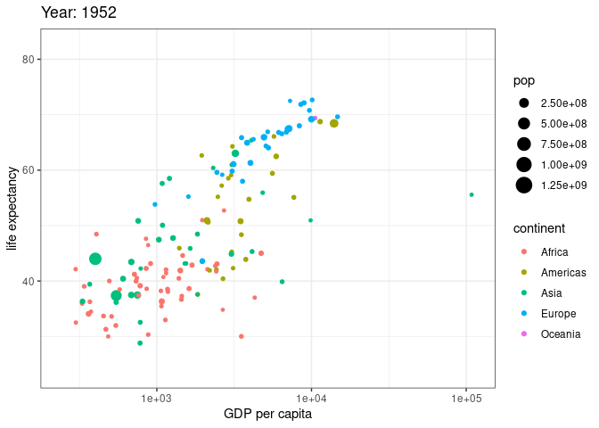

<!-- render("ggplot2.Rmd", md_document()) -->

Find [here](https://teachresources.github.io/RPP/u8/ggplot2.Rmd) the correspondent `*Rmd`.
Find [here](https://rstudio.com/wp-content/uploads/2015/03/ggplot2-cheatsheet.pdf) the `ggplot2 Cheatsheet`.

# _`ggplot2`_ 

## Introduction

`ggplot2` is a powerful and a flexible R package, implemented by Hadley Wickham, for producing elegant graphics.

The concept behind ggplot2 divides plot into three different fundamental parts: Plot = `data` + `Aesthetics` + `Geometry.`

The principal components of every plot can be defined as follow:

- `data` is a data frame
- `Aesthetics` is used to indicate x and y variables. It can also be used to control the color, the size or the shape of points, the height of bars, etc…..
- `Geometry` defines the type of graphics (histogram, box plot, line plot, density plot, dot plot, ….)

There are two major functions in `ggplot2` package: `qplot()` and `ggplot()` functions:

- `qplot()` stands for quick plot, which can be used to produce easily simple plots.
- `ggplot()` function is more flexible and robust than qplot for building a plot piece by piece.

## Amazing resources

- [ggplot2 gallery](https://www.r-graph-gallery.com/all-graphs.html)
- [ggplot2 manual](https://ggplot2.tidyverse.org/reference/)
- [ggplot2 gallery - official](https://exts.ggplot2.tidyverse.org/gallery/)
- [ggplot2 - Essentials](http://www.sthda.com/english/wiki/ggplot2-essentials)

## Grammar of Graphics

Just as the grammar of language helps us construct meaningful sentences out of words, the *Grammar of Graphics* helps us to construct graphical figures out of different visual elements. This grammar gives us a way to talk about parts of a plot: all the circles, lines, arrows, and words that are combined into a diagram for visualizing data. Originally developed by Leland Wilkinson, the Grammar of Graphics was adapted by Hadley Wickham to describe the components of a plot, including

- **Data**: Always start with the data, identify the dimensions you want to visualize.
- **Aesthetics**: Confirm the axes based on the data dimensions, positions of various data points in the plot. Also check if any form of encoding is needed including size, shape, color and so on which are useful for plotting multiple data dimensions.
- **Scale**: Do we need to scale the potential values, use a specific scale to represent multiple values or a range?
Geometric objects: These are popularly known as ‘geoms’. This would cover the way we would depict the data points on the visualization. Should it be points, bars, lines and so on?
- **Statistics**: Do we need to show some statistical measures in the visualization like measures of central tendency, spread, confidence intervals?
- **Facets**: Do we need to create subplots based on specific data dimensions?
- **Coordinate system**: What kind of a coordinate system should the visualization be based on — should it be cartesian or polar?


* [Immage](https://www.google.com/imgres?imgurl=https%3A%2F%2Fblog.gtwang.org%2Fwp-content%2Fuploads%2F2016%2F07%2Fggplot-grammar-of-graphics-stack-1.png&imgrefurl=http%3A%2F%2Fbloggotype.blogspot.com%2F2016%2F08%2Fholiday-notes2-grammar-of-graphics.html&tbnid=ojkzfa9VdM9L3M&vet=12ahUKEwjz-ZqTltXpAhVyI30KHYEfCvMQMygBegUIARDmAQ..i&docid=TvXMfSWvpc8D6M&w=1921&h=1431&q=ggplot2%20grammar&ved=2ahUKEwjz-ZqTltXpAhVyI30KHYEfCvMQMygBegUIARDmAQ) reference.
## Install and Load Library

```{r, message=FALSE}
## install & load ggplot library
#install.package("ggplot2")
library("ggplot2")
library(tidyverse)
```

## Data

```{r, message=FALSE}
head(mtcars)
```

## The Basics (Data/Aesthetics/Geometries)

In order to create a plot, you:

- Call the `ggplot()` function which creates a blank canvas
- Specify aesthetic mappings, which specifies how you want to map variables to visual aspects. In this case we are simply mapping the displ and hwy variables to the x- and y-axes.
- You then add new layers that are geometric objects which will show up on the plot. In this case we add geom_point to add a layer with points (dot) elements as the geometric shapes to represent the data.

```{r, message=FALSE}
# create canvas
ggplot(mtcars)

# variables of interest mapped
ggplot(mtcars, aes(x = cyl, y = mpg))

# data plotted
ggplot(mtcars, aes(x = cyl, y = mpg)) +
  geom_point()
plot <- ggplot(mtcars, aes(x = cyl, y = mpg))
plot + geom_point()
plot +  geom_line()
```

Note that when you added the geom layer you used the addition (`+`) operator. As you add new layers you will always use + to add onto your visualization.

## Aesthetic Mappings

The aesthetic mappings take properties of the data and use them to influence visual characteristics, such as position, color, size, shape, or transparency. Each visual characteristic can thus encode an aspect of the data and be used to convey information.

All aesthetics for a plot are specified in the `aes()` function call (later in this tutorial you will see that each `geom` layer can have its own `aes` specification). For example, we can add a mapping from the class of the cars to a color characteristic:

```{r, message=FALSE}
ggplot(mtcars, aes(x = cyl, y = mpg, color = gear)) +
  geom_point()

class(mtcars$cyl)
color <- as.character(mtcars$gear)

ggplot(mtcars, aes(x = cyl, y = mpg, color = color)) +
  geom_point()

ggplot(mtcars, aes(x = cyl, y = mpg, color = factor(gear))) +
  geom_point()

ggplot(mtcars, aes(x = cyl, y = mpg)) +
  geom_point(color = "blue")

ggplot(mtcars, aes(cyl, mpg, color = factor(gear), size = hp)) + #hp = horsepower
  geom_point()
```

## Specifying Geometric Shapes

Building on these basics, `ggplot2` can be used to build almost any kind of plot you may want. These plots are declared using functions that follow from the Grammar of Graphics.

The most obvious distinction between plots is what geometric objects (geoms) they include. ggplot2 supports a number of different types of geoms, including:

- `geom_point` for drawing individual points (e.g., a scatter plot)
- `geom_line` for drawing lines (e.g., for a line charts)
- `geom_smooth` for drawing smoothed lines (e.g., for simple trends or approximations)
- `geom_bar` for drawing bars (e.g., for bar charts)
- `geom_histogram` for drawing binned values (e.g. a histogram)
- `geom_polygon` for drawing arbitrary shapes
- `geom_map` for drawing polygons in the shape of a map! (You can access the data to use for these maps by using the map_data() function).

```{r, message=FALSE}
# Left column: x and y mapping needed!
ggplot(mtcars, aes(x = cyl, y = mpg)) +
  geom_point()

ggplot(mtcars, aes(x = cyl, y = mpg)) +
  geom_line()

# plot with both points and smoothed line
ggplot(mtcars, aes(x = cyl, y = mpg)) +
    geom_point() +
    geom_smooth(method = "lm")

ggplot(mtcars, aes(x = cyl, y = mpg, color=factor(gear))) +
  geom_point() +
  geom_smooth(method = "lm", color = "red")

# color aesthetic passed to each geom layer
ggplot(mtcars, aes(x = cyl, y = mpg, color = cyl)) +
  geom_point() +
  geom_smooth(method = "lm", se = FALSE)

# color aesthetic specified for only the geom_point layer
ggplot(mtcars, aes(x = cyl, y = mpg)) +
  geom_point(aes(color = factor(cyl))) +
  geom_smooth(method = "lm", se = FALSE)

# Right column: no y mapping needed!
ggplot(data = mtcars, aes(x = gear)) +
  geom_bar()  

ggplot(data = mtcars, aes(x = gear)) +
  geom_histogram() 

ggplot(data = iris, aes(x = Sepal.Length)) +
  geom_histogram() 

ggplot(mtcars, aes(factor(gear), mpg)) +
  geom_violin()

ggplot(mtcars, aes(factor(gear), mpg)) +
  geom_boxplot() +
    geom_point() 

ggplot(mtcars, aes(factor(gear), mpg))  + 
  geom_violin() +
  geom_point(shape = 1, position = "jitter")
```

## Statistical Transformations

If you look at the below bar chart, you’ll notice that the the y axis was defined for us as the count of elements that have the particular type. This count isn’t part of the data set (it’s not a column in mpg), but is instead a **statistical transformation** that the `geom_bar` automatically applies to the data. In particular, it applies the `stat_count` transformation.

```{r, message=FALSE}
ggplot(mtcars, aes(x = gear)) +
  geom_bar()

class_count <- dplyr::count(mpg, class)
class_count

ggplot(mpg, aes(x = hwy)) +
  geom_bar()

ggplot(class_count, aes(x = class, y = n)) +
  geom_bar(stat = "identity")

ggplot(class_count, aes(x = class, y = n, fill=class)) +
  geom_bar(stat = "identity")
```

We can also call `stat_` functions directly to add additional layers. For example, here we create a scatter plot of highway miles for each displacement value and then use `stat_summary` to plot the mean highway miles at each displacement value.

```{r, message=FALSE}
ggplot(mpg, aes(displ, hwy)) + 
  geom_point(color = "grey") + 
  stat_summary(fun = "mean", geom = "line", size = 1, linetype = "dashed")
```

## Position Adjustments

In addition to a default statistical transformation, each geom also has a default `position adjustment` which specifies a set of “rules” as to how different components should be positioned relative to each other. This position is noticeable in a `geom_bar` if you map a different variable to the color visual characteristic:

```{r, message=FALSE}
# bar chart of class, colored by drive (front, rear, 4-wheel)
ggplot(ToothGrowth, aes(x = supp, y=len,  fill = dose)) + 
    geom_bar(stat = "identity")

ggplot(ToothGrowth, aes(x = supp, y=len,  fill = factor(dose))) + 
    geom_bar(stat = "identity")
```

The `geom_bar` by default uses a position adjustment of "`stack`", which makes each rectangle’s height proprotional to its value and stacks them on top of each other. We can use the `position` argument to specify what position adjustment rules to follow:

```{r, message=FALSE}
# position = "dodge": values next to each other
ggplot(mpg, aes(x = class, fill = drv)) + 
  geom_bar(position = "dodge")

# position = "fill": percentage chart
ggplot(mpg, aes(x = class, fill = drv)) + 
  geom_bar(position = "fill")
```

## Managing Scales

Whenever you specify an aesthetic mapping, ggplot uses a particular scale to determine the range of values that the data should map to. Thus when you specify

```{r, message=FALSE}
# color the data by engine type
ggplot(mpg, aes(x = displ, y = hwy, color = class)) +
  geom_point()
```

`ggplot` automatically adds a scale for each mapping to the plot:

```{r, message=FALSE}
# same as above, with explicit scales
ggplot(economics, aes(date, unemploy)) +
  geom_point() +
  scale_y_continuous() +
  scale_colour_discrete()

ggplot(economics, aes(date, unemploy)) + 
  geom_line() +
  scale_y_continuous(limits = c(5000, max(economics$unemploy)))

ggplot(economics, aes(date, unemploy)) + 
  geom_line() +
  scale_y_continuous(limits = c(0, max(economics$unemploy))) +
  scale_x_date(limits = c(as.Date("2000-01-01"), as.Date(Sys.time())))
```

Each scale can be represented by a function with the following name: `scale_`, followed by the name of the aesthetic property, followed by an _ and the name of the scale. A `continuous` scale will handle things like numeric data (where there is a continuous set of numbers), whereas a `discrete` scale will handle things like colors (since there is a small list of distinct colors).

While the default scales will work fine, it is possible to explicitly add different scales to replace the defaults. For example, you can use a scale to change the direction of an axis:

```{r, message=FALSE}
# milage relationship, ordered in reverse
ggplot(mpg, aes(x = displ, y = hwy, color = class)) +
  geom_point() +
  scale_x_reverse() +
  scale_y_reverse()
```

A common parameter to change is which set of colors to use in a plot. While you can use the default coloring, a more common option is to leverage the pre-defined palettes from `colorbrewer.org`. These color sets have been carefully designed to look good and to be viewable to people with certain forms of color blindness. We can leverage color brewer palletes by specifying the `scale_color_brewer()` function, passing the pallete as an argument.

```{r, message=FALSE}
# default color brewer
ggplot(mpg, aes(x = displ, y = hwy, color = class)) +
  geom_point() +
  scale_color_brewer()

# specifying color palette
ggplot(mpg, aes(x = displ, y = hwy, color = class)) +
  geom_point() +
  scale_color_brewer(palette = "Set3")

ggplot(mpg, aes(displ, hwy, color = class)) +
  geom_point() + 
  scale_color_hue(h = c(270, 360)) # blue to red
```

[colorbrewer.org]](https://colorbrewer2.org/#type=sequential&scheme=BuGn&n=3)

### Scales

```{r, message=FALSE}
ggplot(midwest, aes(area, poptotal)) + 
  geom_point() + 
  scale_y_log10()

mpg %>%
  group_by(class) %>% 
  summarize(maxhwy = max(hwy)) %>% 
  ggplot(aes(class, maxhwy)) +
    geom_col() +
    scale_x_discrete(labels = toupper(sort(unique(mpg$manufacturer))))

ggplot(ToothGrowth, aes(x=dose, y=len)) + 
  geom_boxplot()

ggplot(ToothGrowth, aes(x=factor(dose), y=len)) + 
  geom_boxplot()

ggplot(ToothGrowth, aes(x=factor(dose), y=len)) + 
  geom_boxplot() +
  scale_x_discrete(name ="Dose (mg)", limits=c("1","2","0.5"))
```

## Facets

`Facets` are ways of grouping a data plot into multiple different pieces (subplots). This allows you to view a separate plot for each value in a categorical variable. You can construct a plot with multiple facets by using the facet_wrap() function. This will produce a “row” of subplots, one for each categorical variable (the number of rows can be specified with an additional argument):

```{r, message=FALSE}
ggplot(mpg, aes(displ, hwy)) +
  geom_point() +
  facet_wrap(~ year)

ggplot(mpg, aes(displ, hwy)) +
  geom_point() +
  facet_wrap(~ manufacturer)
```

You can also facet_grid to facet your data by more than one categorical variable. Note that we use a tilde (~) in our facet functions. With facet_grid the variable to the left of the tilde will be represented in the rows and the variable to the right will be represented across the columns.

```{r, message=FALSE}
ggplot(mpg, aes(x = displ, y = hwy)) +
  geom_point() +
  theme(axis.title.y = element_blank(),
        axis.text.y=element_blank(),
        axis.ticks.y=element_blank())

```

## Labels & Annotations

Textual labels and annotations (on the plot, axes, geometry, and legend) are an important part of making a plot understandable and communicating information. Although not an explicit part of the Grammar of Graphics (the would be considered a form of geometry), `ggplot` makes it easy to add such annotations.

You can add titles and axis labels to a chart using the` labs()` function (not labels, which is a different R function!):
```{r, message=FALSE}
ggplot(mpg, aes(x = displ, y = hwy, color = class)) +
  geom_point() +
  labs(title = "Fuel Efficiency by Engine Power",
       subtitle = "Fuel economy data from 1999 and 2008 for 38 popular models of cars",
       x = "Engine power (litres displacement)",
       y = "Fuel Efficiency (miles per gallon)",
       color = "Car Type")
```

`ggplot2` offers us a very highly level of customizability in the `theme` function and pre-set themes.

```{r, message=FALSE}
ggplot(mpg, aes(displ, hwy, color = class)) + 
  geom_point() +
  theme_classic()

ggplot(mpg, aes(displ, hwy, color = class)) + 
  geom_point() +
  theme_classic() +
  theme(legend.position = "bottom",
        legend.background = element_rect(fill = "#EEEEEE", color = "black"),
        legend.title = element_blank(),
        axis.title = element_text(size = 16))

ggplot(mpg, aes(displ, hwy, color = class)) + 
  geom_point() +
  theme_classic() +
  theme(legend.position = c(1, 1),
        legend.justification = c(1,1),
        legend.direction = "horizontal",
        legend.title = element_blank()) +
  xlab("Engine Displacement") +
  ylab("Highway Fuel Economy (miles / gallon") +
  ggtitle("Highway fuel economy versus engine displacement",
          "or why do you need that big truck again? ")
```

It is also possible to add labels into the plot itself (e.g., to label each point or line) by adding a new geom_text or geom_label to the plot; effectively, you’re plotting an extra set of data which happen to be the variable names:

```{r, message=FALSE}
# a data table of each car that has best efficiency of its type
best_in_class <- mpg %>%
  group_by(class) %>%
  filter(row_number(desc(hwy)) == 1)

ggplot(mpg, aes(x = displ, y = hwy)) + 
  geom_point(aes(color = class)) +
  geom_label(data = best_in_class, aes(label = model), alpha = 0.5)
```

However, note that two labels overlap one-another in the top left part of the plot. We can use the geom_text_repel function from the ggrepel package to help position labels.

```{r, message=FALSE}
library(ggrepel)

ggplot(mpg, aes(x = displ, y = hwy)) + 
  geom_point(aes(color = class)) +
  geom_text_repel(data = best_in_class, aes(label = model))
```


## Saving plots
Let’s save that great plot we just made. Saving plots in ggplot is done with the `ggsave()` function:
```{r, eval=FALSE, message=FALSE}
ggsave("hwy_vs_displ.png")
ggsave("hwy_vs_displ.png", width = 6, height = 6)
```

## Animation

```{r, eval=FALSE, message=FALSE}
# Get data
library(gapminder)
 
# Charge libraries
library(ggplot2)
library(gganimate)
 
# Make a ggplot, but add frame=year: one image per year
ggplot(gapminder, aes(gdpPercap, lifeExp, size = pop, color = continent)) +
  geom_point() +
  scale_x_log10() +
  theme_bw() +
  # gganimate specific bits
  labs(title = 'Year: {frame_time}', x = 'GDP per capita', y = 'life expectancy') +
  transition_time(year) +
  ease_aes('linear')

# Save at gif
anim_save("271-ggplot2-animated-gif-chart-with-gganimate1.gif")
```



## Maps

```{r, eval=FALSE, message=FALSE}
# Load the library
library(leaflet)

# Note: if you do not already installed it, install it with:
# install.packages("leaflet")

# Background 1: NASA
m <- leaflet() %>% 
   addTiles() %>% 
   setView( lng = 2.34, lat = 48.85, zoom = 5 ) %>% 
   addProviderTiles("NASAGIBS.ViirsEarthAtNight2012")
m
 
# Background 2: World Imagery
m <- leaflet() %>% 
   addTiles() %>% 
   setView( lng = 2.34, lat = 48.85, zoom = 3 ) %>% 
   addProviderTiles("Esri.WorldImagery")
m

# save the widget in a html file if needed.
library(htmlwidgets)
saveWidget(m, file="backgroundMapTile.html")
```

[Tidyuesday](https://duvancho321.github.io/Tidyuesday/Folder/2020/2020-01-07/)

# Reference:
1. [ggplot2 essentials](http://www.sthda.com/english/wiki/ggplot2-essentials)
2. [ggplot2: Elegant Graphics for Data Analysis](https://ggplot2-book.org/)
3. [UC Business Analytics R Programming Guide](https://uc-r.github.io/ggplot_intro)
4. [R graphics with ggplot2 workshop](https://tutorials.iq.harvard.edu/R/Rgraphics/Rgraphics.html)
5. [Visualizations I: Intro to ggplot2](http://joeystanley.com/downloads/180216-ggplot2-part1)
