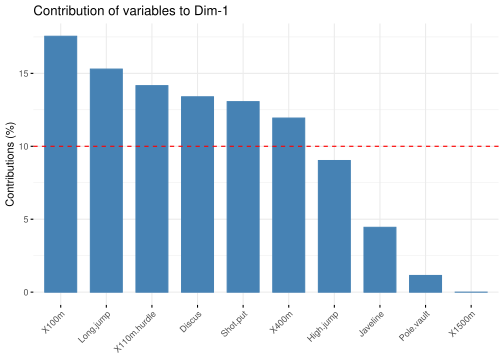
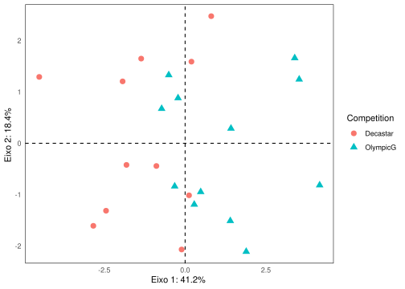
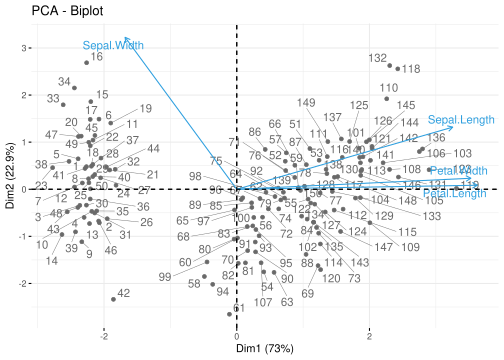
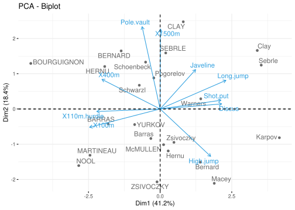
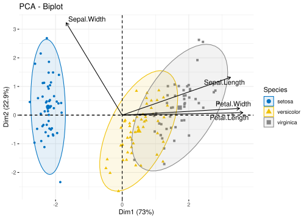
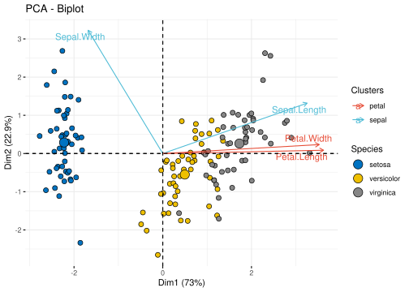

---
# Page settings
layout: default
head_title: Multivariate Statistical Analysis 
keywords:
comments: false

# Hero section
title: Multivariate Statistical Analysis 
description: >

# Micro navigation
micro_nav: false

# Page navigation
page_nav:
    prev:
        content: Graphics and Visualization
        url: '/u8/'
    next:
        content: Projects
        url: '/projects/'
---

Find [here](https://teachresources.github.io/RPP/u9/pca.Rmd) the
correspondent `*Rmd`. This tutorial is from
[here](http://www.sthda.com/english/articles/31-principal-component-methods-in-r-practical-guide/112-pca-principal-component-analysis-essentials/).

Principal Component Methods in R
================================

Principal component methods are used to summarize and visualize the
information contained in a large multivariate data sets. Here, we
provide practical examples and course videos to compute and interpret
principal component methods (PCA, CA, MCA, MFA, etc) using R software.

The following figure illustrates the type of analysis to be performed
depending on the type of variables contained in the data set.

Principal component analysis
============================

Principal component analysis (PCA) allows us to summarize and to
visualize the information in a data set containing
individuals/observations described by multiple inter-correlated
quantitative variables. Each variable could be considered as a different
dimension. If you have more than 3 variables in your data sets, it could
be very difficult to visualize a multi-dimensional hyperspace.

Principal component analysis is used to extract the important
information from a multivariate data table and to express this
information as a set of few new variables called principal components.
These new variables correspond to a linear combination of the originals.
The number of principal components is less than or equal to the number
of original variables.

The information in a given data set corresponds to the total variation
it contains. The goal of PCA is to identify directions (or principal
components) along which the variation in the data is maximal.

In other words, PCA reduces the dimensionality of a multivariate data to
two or three principal components, that can be visualized graphically,
with minimal loss of information.

Basics
------

Understanding the details of PCA requires knowledge of linear algebra.
Here, we’ll explain only the basics with simple graphical representation
of the data.

In the Plot 1A below, the data are represented in the X-Y coordinate
system. The dimension reduction is achieved by identifying the principal
directions, called principal components, in which the data varies.

PCA assumes that the directions with the largest variances are the most
“important” (i.e, the most principal).

In the figure below, the `PC1 axis` is the `first principal direction`
along which the samples show the largest variation. The `PC2 axis` is
the `second most important direction` and it is `orthogonal` to the PC1
axis.

The dimensionality of our two-dimensional data can be reduced to a
single dimension by projecting each sample onto the first principal
component (Plot 1B)

  Technically speaking, the amount of
variance retained by each principal component is measured by the
so-called **eigenvalue**.

Note that, the PCA method is particularly useful when the variables
within the data set are highly correlated. Correlation indicates that
there is redundancy in the data. Due to this redundancy, PCA can be used
to reduce the original variables into a smaller number of new variables
( = **principal components**) explaining most of the variance in the
original variables.

 

Taken together, the main purpose of principal component analysis is to:

-   identify hidden pattern in a data set,
-   reduce the dimensionnality of the data by removing the noise and
    redundancy in the data,
-   identify correlated variables

R Packages
----------

    library("FactoMineR")
    library("factoextra")

    ## Loading required package: ggplot2

    ## Welcome! Want to learn more? See two factoextra-related books at https://goo.gl/ve3WBa

Data for the tutorial
---------------------

We’ll use the demo data sets decathlon2 from the factoextra package:

    data(decathlon2)
    head(decathlon2)

    ##           X100m Long.jump Shot.put
    ## SEBRLE    11.04      7.58    14.83
    ## CLAY      10.76      7.40    14.26
    ## BERNARD   11.02      7.23    14.25
    ## YURKOV    11.34      7.09    15.19
    ## ZSIVOCZKY 11.13      7.30    13.48
    ## McMULLEN  10.83      7.31    13.76
    ##           High.jump X400m
    ## SEBRLE         2.07 49.81
    ## CLAY           1.86 49.37
    ## BERNARD        1.92 48.93
    ## YURKOV         2.10 50.42
    ## ZSIVOCZKY      2.01 48.62
    ## McMULLEN       2.13 49.91
    ##           X110m.hurdle Discus
    ## SEBRLE           14.69  43.75
    ## CLAY             14.05  50.72
    ## BERNARD          14.99  40.87
    ## YURKOV           15.31  46.26
    ## ZSIVOCZKY        14.17  45.67
    ## McMULLEN         14.38  44.41
    ##           Pole.vault Javeline
    ## SEBRLE          5.02    63.19
    ## CLAY            4.92    60.15
    ## BERNARD         5.32    62.77
    ## YURKOV          4.72    63.44
    ## ZSIVOCZKY       4.42    55.37
    ## McMULLEN        4.42    56.37
    ##           X1500m Rank Points
    ## SEBRLE     291.7    1   8217
    ## CLAY       301.5    2   8122
    ## BERNARD    280.1    4   8067
    ## YURKOV     276.4    5   8036
    ## ZSIVOCZKY  268.0    7   8004
    ## McMULLEN   285.1    8   7995
    ##           Competition
    ## SEBRLE       Decastar
    ## CLAY         Decastar
    ## BERNARD      Decastar
    ## YURKOV       Decastar
    ## ZSIVOCZKY    Decastar
    ## McMULLEN     Decastar

Note that, only some of these individuals and variables will be used to
perform the principal component analysis. The coordinates of the
remaining individuals and variables on the factor map will be predicted
after the PCA.

The data used here describes athletes’ performance during two sporting
events (Desctar and OlympicG). It contains 27 individuals (athletes)
described by 13 variables.

In PCA terminology, our data contains:

-   Active individuals (in light blue, rows 1:23) : Individuals that are
    used during the principal component analysis.
-   Supplementary individuals (in dark blue, rows 24:27) : The
    coordinates of these individuals will be predicted using the PCA
    information and parameters obtained with active
    individuals/variables
-   Active variables (in pink, columns 1:10) : Variables that are used
    for the principal component analysis.
-   Supplementary variables: As supplementary individuals, the
    coordinates of these variables will be predicted also. These can be:
    -   Supplementary continuous variables (red): Columns 11 and 12
        corresponding respectively to the rank and the points of
        athletes.
    -   Supplementary qualitative variables (green): Column 13
        corresponding to the two athlete-tic meetings (2004 Olympic Game
        or 2004 Decastar). This is a categorical (or factor) variable
        factor. It can be used to color individuals by groups.

We start by subsetting active individuals and active variables for the
principal component analysis:

    decathlon2.active <- decathlon2[1:23, 1:10]
    head(decathlon2.active[, 1:6], 4)

    ##         X100m Long.jump Shot.put
    ## SEBRLE  11.04      7.58    14.83
    ## CLAY    10.76      7.40    14.26
    ## BERNARD 11.02      7.23    14.25
    ## YURKOV  11.34      7.09    15.19
    ##         High.jump X400m
    ## SEBRLE       2.07 49.81
    ## CLAY         1.86 49.37
    ## BERNARD      1.92 48.93
    ## YURKOV       2.10 50.42
    ##         X110m.hurdle
    ## SEBRLE         14.69
    ## CLAY           14.05
    ## BERNARD        14.99
    ## YURKOV         15.31

Data standardization
--------------------

In principal component analysis, variables are often scaled
(i.e. standardized). This is particularly recommended when variables are
measured in different scales (e.g: kilograms, kilometers, centimeters,
…); otherwise, the PCA outputs obtained will be severely affected.

The goal is to make the variables comparable. Generally variables are
scaled to have i) standard deviation one and ii) mean zero.

The standardization of data is an approach widely used in the context of
gene expression data analysis before PCA and clustering analysis. We
might also want to scale the data when the mean and/or the standard
deviation of variables are largely different.

When scaling variables, the data can be transformed as follow:

$\frac{x\_i - mean(x)}{sd(x)}$

Where `mean(x)` is the mean of `x` values, and `sd(x)` is the standard
deviation (SD).

The R base function `scale()` can be used to standardize the data. It
takes a numeric matrix as an input and performs the scaling on the
columns.

> Note that, by default, the function `PCA()` \[in `FactoMineR`\],
> standardizes the data automatically during the PCA; so you don’t need
> do this transformation before the PCA.

Analysis
--------

The function `PCA()` \[`FactoMineR` package\] can be used. A simplified
format is:

    PCA(X, scale.unit = TRUE, ncp = 5, graph = TRUE)

-   `X`: a data frame. Rows are individuals and columns are numeric
    variables
-   `scale.unit`: a logical value. If TRUE, the data are scaled to unit
    variance before the analysis. This standardization to the same scale
    avoids some variables to become dominant just because of their large
    measurement units. It makes variable comparable.
-   `ncp`: number of dimensions kept in the final results.
-   `graph`: a logical value. If TRUE a graph is displayed.

The R code below, computes principal component analysis on the active
individuals/variables:

    library("FactoMineR")
    decathlon.active <- decathlon2[1:23, 1:10]
    res.pca <- PCA(decathlon2.active, graph = TRUE, scale.unit = TRUE)

The output of the function PCA() is a list, including the following
components:

    print(res.pca)

    ## **Results for the Principal Component Analysis (PCA)**
    ## The analysis was performed on 23 individuals, described by 10 variables
    ## *The results are available in the following objects:
    ## 
    ##    name              
    ## 1  "$eig"            
    ## 2  "$var"            
    ## 3  "$var$coord"      
    ## 4  "$var$cor"        
    ## 5  "$var$cos2"       
    ## 6  "$var$contrib"    
    ## 7  "$ind"            
    ## 8  "$ind$coord"      
    ## 9  "$ind$cos2"       
    ## 10 "$ind$contrib"    
    ## 11 "$call"           
    ## 12 "$call$centre"    
    ## 13 "$call$ecart.type"
    ## 14 "$call$row.w"     
    ## 15 "$call$col.w"     
    ##    description                          
    ## 1  "eigenvalues"                        
    ## 2  "results for the variables"          
    ## 3  "coord. for the variables"           
    ## 4  "correlations variables - dimensions"
    ## 5  "cos2 for the variables"             
    ## 6  "contributions of the variables"     
    ## 7  "results for the individuals"        
    ## 8  "coord. for the individuals"         
    ## 9  "cos2 for the individuals"           
    ## 10 "contributions of the individuals"   
    ## 11 "summary statistics"                 
    ## 12 "mean of the variables"              
    ## 13 "standard error of the variables"    
    ## 14 "weights for the individuals"        
    ## 15 "weights for the variables"

Visualization and Interpretation
--------------------------------

We’ll use the `factoextra` R package to help in the interpretation of
PCA. No matter what function you decide to use `[stats::prcomp()`,
`FactoMiner::PCA()`, `ade4::dudi.pca()`, `ExPosition::epPCA()`\], you
can easily extract and visualize the results of PCA using R functions
provided in the `factoextra` R package.

These functions include:

-   `get_eigenvalue(res.pca)`: Extract the eigenvalues/variances of
    principal components
-   `fviz_eig(res.pca)`: Visualize the eigenvalues
-   `get_pca_ind(res.pca)`, `get_pca_var(res.pca)`: Extract the results
    for individuals and variables, respectively.
-   `fviz_pca_ind(res.pca)`, `fviz_pca_var(res.pca)`: Visualize the
    results individuals and variables, respectively.
-   `fviz_pca_biplot(res.pca)`: Make a biplot of individuals and
    variables.

In the next sections, we’ll illustrate each of these functions.

`Eigenvalues` / `Variances`
---------------------------

As described in previous sections, the `eigenvalues` measure the amount
of variation retained by each principal component. `Eigenvalues` are
large for the first PCs and small for the subsequent PCs. That is, the
first PCs corresponds to the directions with the maximum amount of
variation in the data set.

We examine the `eigenvalues` to determine the number of principal
components to be considered. The eigenvalues and the proportion of
variances (i.e., information) retained by the principal components (PCs)
can be extracted using the function `get_eigenvalue()` \[`factoextra`
package\].

    library("factoextra")
    eig.val <- get_eigenvalue(res.pca)
    eig.val

    ##        eigenvalue variance.percent
    ## Dim.1   4.1242133        41.242133
    ## Dim.2   1.8385309        18.385309
    ## Dim.3   1.2391403        12.391403
    ## Dim.4   0.8194402         8.194402
    ## Dim.5   0.7015528         7.015528
    ## Dim.6   0.4228828         4.228828
    ## Dim.7   0.3025817         3.025817
    ## Dim.8   0.2744700         2.744700
    ## Dim.9   0.1552169         1.552169
    ## Dim.10  0.1219710         1.219710
    ##        cumulative.variance.percent
    ## Dim.1                     41.24213
    ## Dim.2                     59.62744
    ## Dim.3                     72.01885
    ## Dim.4                     80.21325
    ## Dim.5                     87.22878
    ## Dim.6                     91.45760
    ## Dim.7                     94.48342
    ## Dim.8                     97.22812
    ## Dim.9                     98.78029
    ## Dim.10                   100.00000

The sum of all the eigenvalues give a total variance of 10.

The proportion of variation explained by each eigenvalue is given in the
second column. For example, 4.124 divided by 10 equals 0.4124, or, about
41.24% of the variation is explained by this first eigenvalue. The
cumulative percentage explained is obtained by adding the successive
proportions of variation explained to obtain the running total. For
instance, 41.242% plus 18.385% equals 59.627%, and so forth. Therefore,
about 59.627% of the variation is explained by the first two eigenvalues
together.

Eigenvalues can be used to determine the number of principal components
to retain after PCA (Kaiser 1961):

-   An eigenvalue &gt; 1 indicates that PCs account for more variance
    than accounted by one of the original variables in standardized
    data. This is commonly used as a cutoff point for which PCs are
    retained. This holds true only when the data are standardized.

-   You can also limit the number of component to that number that
    accounts for a certain fraction of the total variance. For example,
    if you are satisfied with 70% of the total variance explained then
    use the number of components to achieve that.

Unfortunately, there is no well-accepted objective way to decide how
many principal components are enough. This will depend on the specific
field of application and the specific data set. In practice, we tend to
look at the first few principal components in order to find interesting
patterns in the data.

In our analysis, the first three principal components explain 72% of the
variation. This is an acceptably large percentage.

An alternative method to determine the number of principal components is
to look at a Scree Plot, which is the plot of eigenvalues ordered from
largest to the smallest. The number of component is determined at the
point, beyond which the remaining eigenvalues are all relatively small
and of comparable size.

The scree plot can be produced using the function `fviz_eig()` or
`fviz_screeplot()` \[`factoextra` package\].

    fviz_eig(res.pca, addlabels = TRUE, ylim = c(0, 50))

> From the plot above, we might want to stop at the fifth principal
> component. 87% of the information (variances) contained in the data
> are retained by the first five principal components.

Graph of variables
------------------

### Results

A simple method to extract the results, for variables, from a PCA output
is to use the function`get_pca_var()` \[`factoextra` package\]. This
function provides a list of matrices containing all the results for the
active variables (coordinates, correlation between variables and axes,
squared cosine and contributions).

    var <- get_pca_var(res.pca)
    var

    ## Principal Component Analysis Results for variables
    ##  ===================================================
    ##   Name      
    ## 1 "$coord"  
    ## 2 "$cor"    
    ## 3 "$cos2"   
    ## 4 "$contrib"
    ##   Description                                    
    ## 1 "Coordinates for the variables"                
    ## 2 "Correlations between variables and dimensions"
    ## 3 "Cos2 for the variables"                       
    ## 4 "contributions of the variables"

The components of the `get_pca_var()` can be used in the plot of
variables as follow:

-   `var$coord`: coordinates of variables to create a scatter plot
-   `var$cos2`: represents the quality of representation for variables
    on the factor map. It’s calculated as the squared coordinates:
    var.cos2 = var.coord \* var.coord.
-   v`ar$contrib`: contains the contributions (in percentage) of the
    variables to the principal components. The contribution of a
    variable (var) to a given principal component is (in percentage) :
    (var.cos2 \* 100) / (total cos2 of the component).

> Note that, it’s possible to plot variables and to color them according
> to either i) their quality on the factor map (cos2) or ii) their
> contribution values to the principal components (contrib).

The different components can be accessed as follow:

    # Coordinates
    head(var$coord)

    ##                   Dim.1
    ## X100m        -0.8506257
    ## Long.jump     0.7941806
    ## Shot.put      0.7339127
    ## High.jump     0.6100840
    ## X400m        -0.7016034
    ## X110m.hurdle -0.7641252
    ##                    Dim.2
    ## X100m        -0.17939806
    ## Long.jump     0.28085695
    ## Shot.put      0.08540412
    ## High.jump    -0.46521415
    ## X400m         0.29017826
    ## X110m.hurdle -0.02474081
    ##                   Dim.3
    ## X100m         0.3015564
    ## Long.jump    -0.1905465
    ## Shot.put      0.5175978
    ## High.jump     0.3300852
    ## X400m         0.2835329
    ## X110m.hurdle  0.4488873
    ##                    Dim.4
    ## X100m         0.03357320
    ## Long.jump    -0.11538956
    ## Shot.put      0.12846837
    ## High.jump     0.14455012
    ## X400m         0.43082552
    ## X110m.hurdle -0.01689589
    ##                   Dim.5
    ## X100m        -0.1944440
    ## Long.jump     0.2331567
    ## Shot.put     -0.2488129
    ## High.jump     0.4027002
    ## X400m         0.1039085
    ## X110m.hurdle  0.2242200

    # Cos2: quality on the factore map
    head(var$cos2)

    ##                  Dim.1
    ## X100m        0.7235641
    ## Long.jump    0.6307229
    ## Shot.put     0.5386279
    ## High.jump    0.3722025
    ## X400m        0.4922473
    ## X110m.hurdle 0.5838873
    ##                     Dim.2
    ## X100m        0.0321836641
    ## Long.jump    0.0788806285
    ## Shot.put     0.0072938636
    ## High.jump    0.2164242070
    ## X400m        0.0842034209
    ## X110m.hurdle 0.0006121077
    ##                   Dim.3
    ## X100m        0.09093628
    ## Long.jump    0.03630798
    ## Shot.put     0.26790749
    ## High.jump    0.10895622
    ## X400m        0.08039091
    ## X110m.hurdle 0.20149984
    ##                     Dim.4
    ## X100m        0.0011271597
    ## Long.jump    0.0133147506
    ## Shot.put     0.0165041211
    ## High.jump    0.0208947375
    ## X400m        0.1856106269
    ## X110m.hurdle 0.0002854712
    ##                   Dim.5
    ## X100m        0.03780845
    ## Long.jump    0.05436203
    ## Shot.put     0.06190783
    ## High.jump    0.16216747
    ## X400m        0.01079698
    ## X110m.hurdle 0.05027463

    # Contributions to the principal components
    head(var$contrib)

    ##                  Dim.1      Dim.2
    ## X100m        17.544293  1.7505098
    ## Long.jump    15.293168  4.2904162
    ## Shot.put     13.060137  0.3967224
    ## High.jump     9.024811 11.7715838
    ## X400m        11.935544  4.5799296
    ## X110m.hurdle 14.157544  0.0332933
    ##                  Dim.3       Dim.4
    ## X100m         7.338659  0.13755240
    ## Long.jump     2.930094  1.62485936
    ## Shot.put     21.620432  2.01407269
    ## High.jump     8.792888  2.54987951
    ## X400m         6.487636 22.65090599
    ## X110m.hurdle 16.261261  0.03483735
    ##                  Dim.5
    ## X100m         5.389252
    ## Long.jump     7.748815
    ## Shot.put      8.824401
    ## High.jump    23.115504
    ## X400m         1.539012
    ## X110m.hurdle  7.166193

In this section, we describe how to visualize variables and draw
conclusions about their correlations. Next, we highlight variables
according to either i) their quality of representation on the factor map
or ii) their contributions to the principal components.

Correlation circle
------------------

The correlation between a variable and a principal component (PC) is
used as the coordinates of the variable on the PC. The representation of
variables differs from the plot of the observations: The observations
are represented by their projections, but the variables are represented
by their correlations (Abdi and Williams 2010).

    # Coordinates of variables
    head(var$coord, 4)

    ##                Dim.1       Dim.2
    ## X100m     -0.8506257 -0.17939806
    ## Long.jump  0.7941806  0.28085695
    ## Shot.put   0.7339127  0.08540412
    ## High.jump  0.6100840 -0.46521415
    ##                Dim.3      Dim.4
    ## X100m      0.3015564  0.0335732
    ## Long.jump -0.1905465 -0.1153896
    ## Shot.put   0.5175978  0.1284684
    ## High.jump  0.3300852  0.1445501
    ##                Dim.5
    ## X100m     -0.1944440
    ## Long.jump  0.2331567
    ## Shot.put  -0.2488129
    ## High.jump  0.4027002

To plot variables, type this:

    fviz_pca_var(res.pca, col.var = "black")

The plot above is also known as variable correlation plots. It shows the
relationships between all variables. It can be interpreted as follow:

-   Positively correlated variables are grouped together.
-   Negatively correlated variables are positioned on opposite sides of
    the plot origin (opposed quadrants).
-   The distance between variables and the origin measures the quality
    of the variables on the factor map. Variables that are away from the
    origin are well represented on the factor map.

Quality of representation
-------------------------

The quality of representation of the variables on factor map is called
cos2 (square cosine, squared coordinates) . You can access to the cos2
as follow:

    head(var$cos2, 4)

    ##               Dim.1       Dim.2
    ## X100m     0.7235641 0.032183664
    ## Long.jump 0.6307229 0.078880629
    ## Shot.put  0.5386279 0.007293864
    ## High.jump 0.3722025 0.216424207
    ##                Dim.3      Dim.4
    ## X100m     0.09093628 0.00112716
    ## Long.jump 0.03630798 0.01331475
    ## Shot.put  0.26790749 0.01650412
    ## High.jump 0.10895622 0.02089474
    ##                Dim.5
    ## X100m     0.03780845
    ## Long.jump 0.05436203
    ## Shot.put  0.06190783
    ## High.jump 0.16216747

You can visualize the cos2 of variables on all the dimensions using the
corrplot package:

    library("corrplot")

    ## corrplot 0.84 loaded

    corrplot(var$cos2, is.corr=FALSE)

It’s also possible to create a bar plot of variables cos2 using the
function `fviz_cos2()` \[in `factoextra`\]:

    # Total cos2 of variables on Dim.1 and Dim.2
    fviz_cos2(res.pca, choice = "var", axes = 1:2)

Note that,

-   A high cos2 indicates a good representation of the variable on the
    principal component. In this case the variable is positioned close
    to the circumference of the correlation circle.

-   A low cos2 indicates that the variable is not perfectly represented
    by the PCs. In this case the variable is close to the center of the
    circle.

For a given variable, the sum of the cos2 on all the principal
components is equal to one.

If a variable is perfectly represented by only two principal components
(Dim.1 & Dim.2), the sum of the cos2 on these two PCs is equal to one.
In this case the variables will be positioned on the circle of
correlations.

For some of the variables, more than 2 components might be required to
perfectly represent the data. In this case the variables are positioned
inside the circle of correlations.

In summary:

-   The cos2 values are used to estimate the quality of the
    representation
-   The closer a variable is to the circle of correlations, the better
    its representation on the factor map (and the more important it is
    to interpret these components)
-   Variables that are closed to the center of the plot are less
    important for the first components.

It’s possible to color variables by their cos2 values using the argument
col.var = “cos2”. This produces a gradient colors. In this case, the
argument gradient.cols can be used to provide a custom color. For
instance, gradient.cols = c(“white”, “blue”, “red”) means that:

-   variables with low cos2 values will be colored in “white”
-   variables with mid cos2 values will be colored in “blue”
-   variables with high cos2 values will be colored in red

<!-- -->

    # Color by cos2 values: quality on the factor map
    fviz_pca_var(res.pca, col.var = "cos2",
                 gradient.cols = c("#00AFBB", "#E7B800", "#FC4E07"), 
                 repel = TRUE # Avoid text overlapping
                 )

Note that, it’s also possible to change the transparency of the
variables according to their cos2 values using the option alpha.var =
“cos2”. For example, type this:

    # Change the transparency by cos2 values
    fviz_pca_var(res.pca, alpha.var = "cos2")

Contributions of variables to PCs
---------------------------------

The contributions of variables in accounting for the variability in a
given principal component are expressed in percentage.

-   Variables that are correlated with PC1 (i.e., Dim.1) and PC2 (i.e.,
    Dim.2) are the most important in explaining the variability in the
    data set.
-   Variables that do not correlated with any PC or correlated with the
    last dimensions are variables with low contribution and might be
    removed to simplify the overall analysis.

The contribution of variables can be extracted as follow:

    head(var$contrib, 4)

    ##               Dim.1      Dim.2
    ## X100m     17.544293  1.7505098
    ## Long.jump 15.293168  4.2904162
    ## Shot.put  13.060137  0.3967224
    ## High.jump  9.024811 11.7715838
    ##               Dim.3     Dim.4
    ## X100m      7.338659 0.1375524
    ## Long.jump  2.930094 1.6248594
    ## Shot.put  21.620432 2.0140727
    ## High.jump  8.792888 2.5498795
    ##               Dim.5
    ## X100m      5.389252
    ## Long.jump  7.748815
    ## Shot.put   8.824401
    ## High.jump 23.115504

> The larger the value of the contribution, the more the variable
> contributes to the component.

It’s possible to use the function corrplot() \[corrplot package\] to
highlight the most contributing variables for each dimension:

    library("corrplot")
    corrplot(var$contrib, is.corr=FALSE)   

The function `fviz_contrib()` \[`factoextra` package\] can be used to
draw a bar plot of variable contributions. If your data contains many
variables, you can decide to show only the top contributing variables.
The R code below shows the top 10 variables contributing to the
principal components:

    # Contributions of variables to PC1
    fviz_contrib(res.pca, choice = "var", axes = 1, top = 10)

    # Contributions of variables to PC2
    fviz_contrib(res.pca, choice = "var", axes = 2, top = 10)

The total contribution to PC1 and PC2 is obtained with the following R
code:

    fviz_contrib(res.pca, choice = "var", axes = 1:2, top = 10)

The red dashed line on the graph above indicates the expected average
contribution. If the contribution of the variables were uniform, the
expected value would be 1/length(variables) = 1/10 = 10%. For a given
component, a variable with a contribution larger than this cutoff could
be considered as important in contributing to the component.

Note that, the total contribution of a given variable, on explaining the
variations retained by two principal components, say PC1 and PC2, is
calculated as `contrib = [(C1 * Eig1) + (C2 * Eig2)]/(Eig1 + Eig2)`,
where

-   C1 and C2 are the contributions of the variable on PC1 and PC2,
    respectively
-   Eig1 and Eig2 are the eigenvalues of PC1 and PC2, respectively.
    Recall that eigenvalues measure the amount of variation retained by
    each PC.

In this case, the expected average contribution (cutoff) is calculated
as follow: As mentioned above, if the contributions of the 10 variables
were uniform, the expected average contribution on a given PC would be
1/10 = 10%. The expected average contribution of a variable for PC1 and
PC2 is : `[(10* Eig1) + (10 * Eig2)]/(Eig1 + Eig2)`.

> It can be seen that the variables - X100m, Long.jump and Pole.vault -
> contribute the most to the dimensions 1 and 2.

The most important (or, contributing) variables can be highlighted on
the correlation plot as follow:

    fviz_pca_var(res.pca, col.var = "contrib",
                 gradient.cols = c("#00AFBB", "#E7B800", "#FC4E07"))

Note that, it’s also possible to change the transparency of variables
according to their contrib values using the option alpha.var =
“contrib”. For example, type this:

    # Change the transparency by contrib values
    fviz_pca_var(res.pca, alpha.var = "contrib")

Color by a custom continuous variable
-------------------------------------

In the previous sections, we showed how to color variables by their
contributions and their cos2. Note that, it’s possible to color
variables by any custom continuous variable. The coloring variable
should have the same length as the number of active variables in the PCA
(here n = 10).

For example, type this:

    # Create a random continuous variable of length 10
    set.seed(123)
    my.cont.var <- rnorm(10)
    # Color variables by the continuous variable
    fviz_pca_var(res.pca, col.var = my.cont.var,
                 gradient.cols = c("blue", "yellow", "red"),
                 legend.title = "Cont.Var")

Color by groups
---------------

It’s also possible to change the color of variables by groups defined by
a qualitative/categorical variable, also called factor in R terminology.

As we don’t have any grouping variable in our data sets for classifying
variables, we’ll create it.

In the following demo example, we start by classifying the variables
into 3 groups using the kmeans clustering algorithm. Next, we use the
clusters returned by the kmeans algorithm to color variables.

    # Create a grouping variable using kmeans
    # Create 3 groups of variables (centers = 3)
    set.seed(123)
    res.km <- kmeans(var$coord, centers = 3, nstart = 25)
    grp <- as.factor(res.km$cluster)
    # Color variables by groups
    fviz_pca_var(res.pca, col.var = grp, 
                 palette = c("#0073C2FF", "#EFC000FF", "#868686FF"),
                 legend.title = "Cluster")

Dimension description
---------------------

In the section PCA variable contributions, we described how to highlight
variables according to their contributions to the principal components.

Note also that, the function `dimdesc()` \[in `FactoMineR`\], for
dimension description, can be used to identify the most significantly
associated variables with a given principal component. It can be used as
follow:

    res.desc <- dimdesc(res.pca, axes = c(1,2), proba = 0.05)
    # Description of dimension 1
    res.desc$Dim.1

    ## $quanti
    ##              correlation
    ## Long.jump      0.7941806
    ## Discus         0.7432090
    ## Shot.put       0.7339127
    ## High.jump      0.6100840
    ## Javeline       0.4282266
    ## X400m         -0.7016034
    ## X110m.hurdle  -0.7641252
    ## X100m         -0.8506257
    ##                   p.value
    ## Long.jump    6.059893e-06
    ## Discus       4.842563e-05
    ## Shot.put     6.723102e-05
    ## High.jump    1.993677e-03
    ## Javeline     4.149192e-02
    ## X400m        1.910387e-04
    ## X110m.hurdle 2.195812e-05
    ## X100m        2.727129e-07
    ## 
    ## attr(,"class")
    ## [1] "condes" "list "

    res.desc$Dim.2

    ## $quanti
    ##            correlation
    ## Pole.vault   0.8074511
    ## X1500m       0.7844802
    ## High.jump   -0.4652142
    ##                 p.value
    ## Pole.vault 3.205016e-06
    ## X1500m     9.384747e-06
    ## High.jump  2.529390e-02
    ## 
    ## attr(,"class")
    ## [1] "condes" "list "

In the output above, `$quanti` means results for quantitative variables.
Note that, variables are sorted by the `p-value` of the correlation.

Graph of individuals
--------------------

The results, for individuals can be extracted using the function
`get_pca_ind()` \[`factoextra` package\]. Similarly to the
`get_pca_var()`, the function `get_pca_ind()` provides a list of
matrices containing all the results for the individuals (coordinates,
correlation between individuals and axes, squared cosine and
contributions).

    ind <- get_pca_ind(res.pca)
    ind

    ## Principal Component Analysis Results for individuals
    ##  ===================================================
    ##   Name      
    ## 1 "$coord"  
    ## 2 "$cos2"   
    ## 3 "$contrib"
    ##   Description                       
    ## 1 "Coordinates for the individuals" 
    ## 2 "Cos2 for the individuals"        
    ## 3 "contributions of the individuals"

    # Coordinates of individuals
    head(ind$coord)

    ##                Dim.1      Dim.2
    ## SEBRLE     0.1955047  1.5890567
    ## CLAY       0.8078795  2.4748137
    ## BERNARD   -1.3591340  1.6480950
    ## YURKOV    -0.8889532 -0.4426067
    ## ZSIVOCZKY -0.1081216 -2.0688377
    ## McMULLEN   0.1212195 -1.0139102
    ##                Dim.3       Dim.4
    ## SEBRLE     0.6424912  0.08389652
    ## CLAY      -1.3873827  1.29838232
    ## BERNARD    0.2005584 -1.96409420
    ## YURKOV     2.5295843  0.71290837
    ## ZSIVOCZKY -1.3342591 -0.10152796
    ## McMULLEN  -0.8625170  1.34164291
    ##                 Dim.5
    ## SEBRLE     1.16829387
    ## CLAY      -0.82498206
    ## BERNARD    0.08419345
    ## YURKOV     0.40782264
    ## ZSIVOCZKY -0.20145217
    ## McMULLEN   1.62151286

    # Quality of individuals
    head(ind$cos2)

    ##                 Dim.1      Dim.2
    ## SEBRLE    0.007530179 0.49747323
    ## CLAY      0.048701249 0.45701660
    ## BERNARD   0.197199804 0.28996555
    ## YURKOV    0.096109800 0.02382571
    ## ZSIVOCZKY 0.001574385 0.57641944
    ## McMULLEN  0.002175437 0.15219499
    ##                 Dim.3       Dim.4
    ## SEBRLE    0.081325232 0.001386688
    ## CLAY      0.143628117 0.125791741
    ## BERNARD   0.004294015 0.411819183
    ## YURKOV    0.778230322 0.061812637
    ## ZSIVOCZKY 0.239754152 0.001388216
    ## McMULLEN  0.110137872 0.266486530
    ##                  Dim.5
    ## SEBRLE    0.2689026575
    ## CLAY      0.0507850580
    ## BERNARD   0.0007567259
    ## YURKOV    0.0202279796
    ## ZSIVOCZKY 0.0054654972
    ## McMULLEN  0.3892621478

    # Contributions of individuals
    head(ind$contrib)

    ##                Dim.1      Dim.2
    ## SEBRLE    0.04029447  5.9714533
    ## CLAY      0.68805664 14.4839248
    ## BERNARD   1.94740183  6.4234107
    ## YURKOV    0.83308415  0.4632733
    ## ZSIVOCZKY 0.01232413 10.1217143
    ## McMULLEN  0.01549089  2.4310854
    ##                Dim.3       Dim.4
    ## SEBRLE     1.4483919  0.03734589
    ## CLAY       6.7537381  8.94458283
    ## BERNARD    0.1411345 20.46819433
    ## YURKOV    22.4517396  2.69663605
    ## ZSIVOCZKY  6.2464325  0.05469230
    ## McMULLEN   2.6102794  9.55055888
    ##                 Dim.5
    ## SEBRLE     8.45894063
    ## CLAY       4.21794385
    ## BERNARD    0.04393073
    ## YURKOV     1.03075263
    ## ZSIVOCZKY  0.25151025
    ## McMULLEN  16.29493304

Plots: quality and contribution
-------------------------------

The `fviz_pca_ind()` is used to produce the graph of individuals. To
create a simple plot, type this:

    ind <- fviz_pca_ind(res.pca, geom = "point", col.ind = rownames(decathlon2.active))

    fviz_pca_ind(res.pca, col.ind = "cos2", 
                 gradient.cols = c("#00AFBB", "#E7B800", "#FC4E07"),
                 repel = TRUE) # Avoid text overlapping (slow if many points)

    fviz_pca_ind(res.pca, pointsize = "cos2", 
                 pointshape = 21, fill = "#E7B800",
                 repel = TRUE) # Avoid text overlapping (slow if many points)

    fviz_pca_ind(res.pca, col.ind = "cos2", pointsize = "cos2",
                 gradient.cols = c("#00AFBB", "#E7B800", "#FC4E07"),
                 repel = TRUE) # Avoid text overlapping (slow if many points)

`ggplot2` plot

    plot <- ggplot(ind$data, aes(x=x, y=y, color=decathlon2$Competition[1:23], shape=decathlon2$Competition[1:23])) + 
      geom_point(size=3) +
      xlab(paste0("Eixo 1: ", round(res.pca$eig[1,2:2], 1), "% ")) + 
      ylab(paste0("Eixo 2: ", round(res.pca$eig[2,2:2], 1), "% ")) + 
      ##ggtitle("PCA All data") +
      labs(color="Competition", shape="Competition") +  geom_vline(xintercept=0, linetype="dashed") +
      geom_hline( yintercept=0, linetype="dashed")

    plot

    plot +
      theme_minimal() +
      theme(panel.grid = element_blank(), panel.border = element_rect(fill= "transparent"))

To create a bar plot of the quality of representation (cos2) of
individuals on the factor map, you can use the function fviz\_cos2() as
previously described for variables:

    fviz_cos2(res.pca, choice = "ind")

To visualize the contribution of individuals to the first two principal
components, type this:

    # Total contribution on PC1 and PC2
    fviz_contrib(res.pca, choice = "ind", axes = 1:2)

Color by groups
---------------

Here, we describe how to color individuals by group. Additionally, we
show how to add concentration `ellipses` and `confidence ellipses` by
groups. For this, we’ll use the iris data as demo data sets.

The column “Species” will be used as grouping variable. We start by
computing principal component analysis as follow:

    # The variable Species (index = 5) is removed
    # before PCA analysis
    iris.pca <- PCA(iris[,-5], graph = FALSE)

In the R code below: the argument habillage or col.ind can be used to
specify the factor variable for coloring the individuals by groups.

To add a concentration ellipse around each group, specify the argument
`addEllipses = TRUE.` The argument palette can be used to change group
colors.

    fviz_pca_ind(iris.pca,
                 geom.ind = "point", # show points only (nbut not "text")
                 col.ind = iris$Species, # color by groups
                 palette = c("#00AFBB", "#E7B800", "#FC4E07"),
                 addEllipses = TRUE, # Concentration ellipses
                 legend.title = "Groups"
                 )

    # Add confidence ellipses
    fviz_pca_ind(iris.pca, geom.ind = "point", col.ind = iris$Species, 
                 palette = c("#00AFBB", "#E7B800", "#FC4E07"),
                 addEllipses = TRUE, ellipse.type = "confidence",
                 legend.title = "Groups"
                 )

    fviz_pca_ind(iris.pca,
                 label = "none", # hide individual labels
                 habillage = iris$Species, # color by groups
                 addEllipses = TRUE, # Concentration ellipses
                 palette = "jco"
                 )

Graphical parameters
--------------------

To change easily the graphical of any ggplots, you can use the function
ggpar() \[ggpubr package\]

The graphical parameters that can be changed using ggpar() include:

-   Main titles, axis labels and legend titles
-   Legend position. Possible values: “top”, “bottom”, “left”, “right”,
    “none”.
-   Color palette.
-   Themes. Allowed values include: `theme_gray(`), `theme_bw()`,
    `theme_minimal()`, `theme_classic()`, `theme_void()`.

<!-- -->

    ind.p <- fviz_pca_ind(iris.pca, geom = "point", col.ind = iris$Species)
    ggpubr::ggpar(ind.p,
                  title = "Principal Component Analysis",
                  subtitle = "Iris data set",
                  caption = "Source: factoextra",
                  xlab = "PC1", ylab = "PC2",
                  legend.title = "Species", legend.position = "top",
                  ggtheme = theme_gray(), palette = "jco")

    ## Biplot
    fviz_pca_biplot(res.pca, repel = TRUE,
                    col.var = "#2E9FDF", # Variables color
                    col.ind = "#696969") # Individuals color

    fviz_pca_biplot(iris.pca, 
                    col.ind = iris$Species, palette = "jco", 
                    addEllipses = TRUE, label = "var",
                    col.var = "black", repel = TRUE,
                    legend.title = "Species")

    fviz_pca_biplot(iris.pca, 
                    # Fill individuals by groups
                    geom.ind = "point",
                    pointshape = 21,
                    pointsize = 2.5,
                    fill.ind = iris$Species,
                    col.ind = "black",
                    # Color variable by groups
                    col.var = factor(c("sepal", "sepal", "petal", "petal")),
                    legend.title = list(fill = "Species", color = "Clusters"),
                    repel = TRUE) +       # Avoid label overplotting
      ggpubr::fill_palette("jco") +      # Indiviual fill color
      ggpubr::color_palette("npg")      # Variable colors

    fviz_pca_biplot(iris.pca, 
                    # Individuals
                    geom.ind = "point",
                    fill.ind = iris$Species, col.ind = "black",
                    pointshape = 21, pointsize = 2,
                    palette = "jco",
                    addEllipses = TRUE,
                    # Variables
                    alpha.var ="contrib", col.var = "contrib",
                    gradient.cols = "RdYlBu", 
                    legend.title = list(fill = "Species", color = "Contrib", alpha = "Contrib"))

Reference:
==========

-   [Plotting PCA/clustering results using ggplot2 and
    ggfortify](https://rpubs.com/sinhrks/plot_pca)
